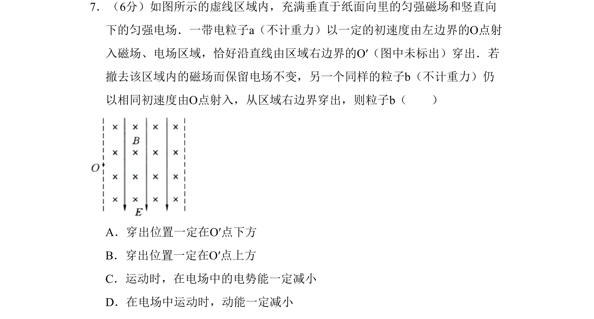

## 题面

## 摘要

带电粒子在正交匀强电场和磁场中的直线运动及仅电场下的偏转问题，考查速度选择器原理和电场力做功。

## 关联考点

- [[302-带电粒子复合场运动|速度选择器]]
- [[844-带电粒子在复合场中的运动|带电粒子在复合场中的运动]]
- [[673-电场力做功|电场力做功]]
- [[电势能变化]]

## 答案与解析

> 📄 原 PDF 第 3 页：`素材/真题/北京/2008-2024·（北京）物理高考真题/2009年高考物理试卷（北京）（解析卷）.pdf`

<!-- 题干文本-start -->
## 题干文本
7．（6分）如图所示的虚线区域内，充满垂直于纸面向里的匀强磁场和竖直向
下的匀强电场．一带电粒子a（不计重力）以一定的初速度由左边界的O点射
入磁场、电场区域，恰好沿直线由区域右边界的O′（图中未标出）穿出．若
撤去该区域内的磁场而保留电场不变，另一个同样的粒子b（不计重力）仍
以相同初速度由O点射入，从区域右边界穿出，则粒子b（　　）
A．穿出位置一定在O′点下方
B．穿出位置一定在O′点上方
C．运动时，在电场中的电势能一定减小
D．在电场中运动时，动能一定减小
<!-- 题干文本-end -->

<!-- 解析文本-start -->
## 解析文本

<!-- 解析文本-end -->
