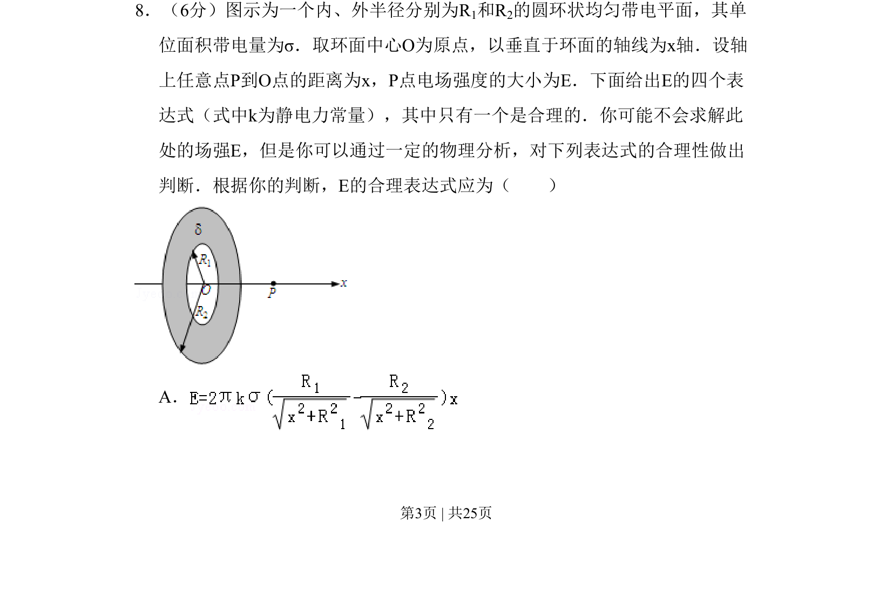
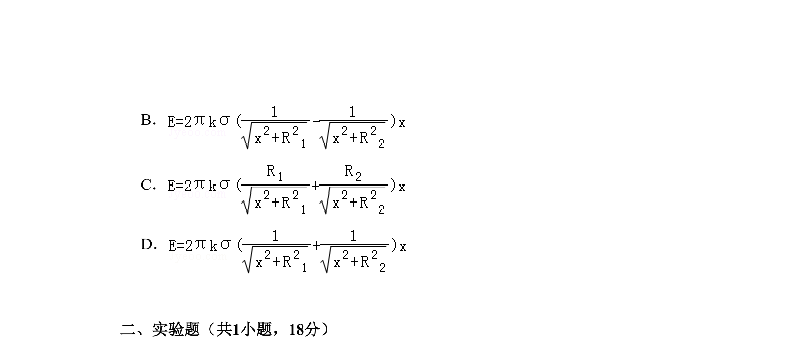

## 题面

## 摘要

考查通过量纲分析和特殊值法判断均匀带电圆环轴线上电场强度表达式的合理性。

## 关联考点

- [[277-电场强度|电场强度]]
- [[832-量纲分析|量纲分析]]
- [[1116-赋值|特殊值法]]
- [[610-微元法|微元法]]

## 答案与解析

> 📄 原 PDF 第 3 页：`素材/真题/北京/2008-2024·（北京）物理高考真题/2009年高考物理试卷（北京）（解析卷）.pdf`
