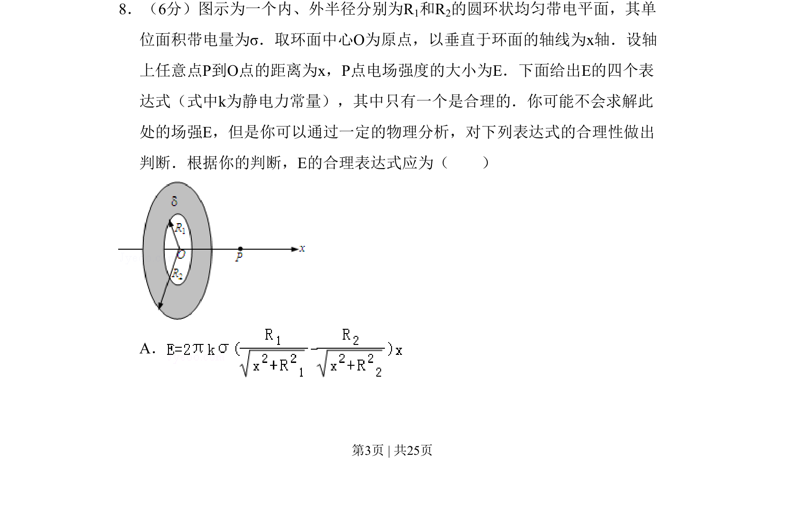
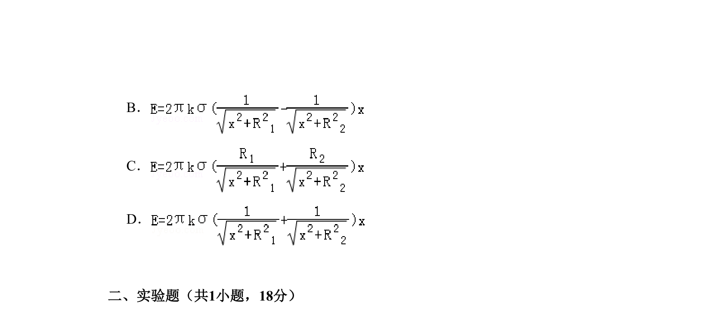

## 题面

## 摘要

考查通过量纲分析和特殊值法判断均匀带电圆环轴线上电场强度表达式的合理性。

## 关联考点

- [[277-电场强度|电场强度]]
- [[832-量纲分析|量纲分析]]
- [[1116-赋值|特殊值法]]
- [[610-微元法|微元法]]

## 答案与解析

> 📄 原 PDF 第 3 页：`素材/真题/北京/2008-2024·（北京）物理高考真题/2009年高考物理试卷（北京）（解析卷）.pdf`

<!-- 题干文本-start -->
## 题干文本
8．（6分）图示为一个内、外半径分别为R1和R2的圆环状均匀带电平面，其单
位面积带电量为σ．取环面中心O为原点，以垂直于环面的轴线为x轴．设轴
上任意点P到O点的距离为x，P点电场强度的大小为E．下面给出E的四个表
达式（式中k为静电力常量），其中只有一个是合理的．你可能不会求解此
处的场强E，但是你可以通过一定的物理分析，对下列表达式的合理性做出
判断．根据你的判断，E的合理表达式应为（　　）
A．
<!-- 题干文本-end -->

<!-- 解析文本-start -->
## 解析文本

<!-- 解析文本-end -->
