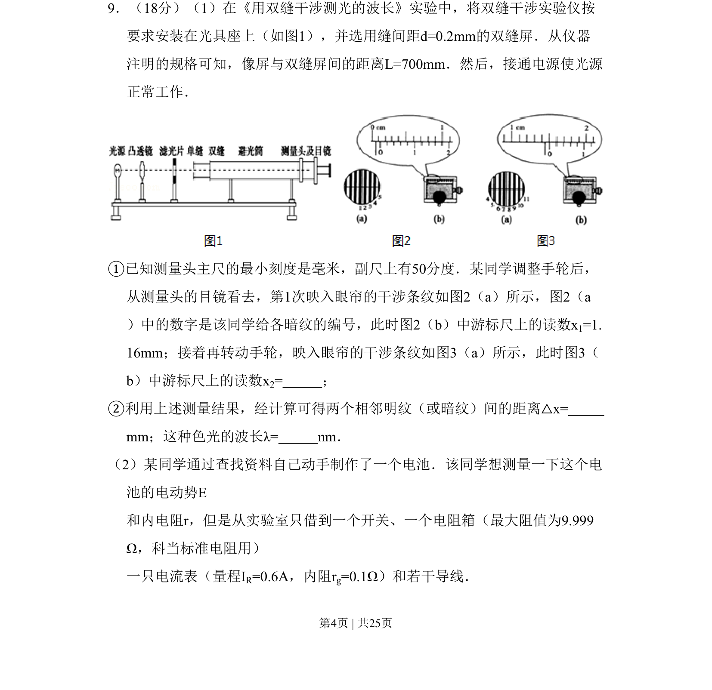
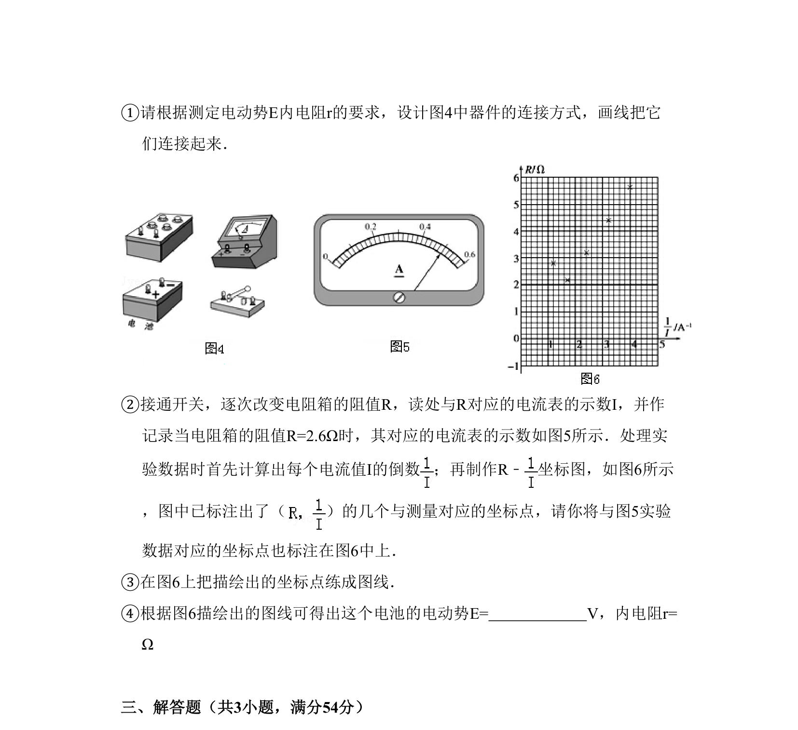

## 题面

## 摘要

双缝干涉测波长、测电源电动势和内阻两个实验的综合考查

## 关联考点

- [[552-双缝干涉|双缝干涉]]
- [[波长测量]]
- [[848-游标卡尺读数|游标卡尺读数]]
- [[测电源电动势和内阻]]

## 答案与解析

> 📄 原 PDF 第 4 页：`素材/真题/北京/2008-2024·（北京）物理高考真题/2009年高考物理试卷（北京）（解析卷）.pdf`
