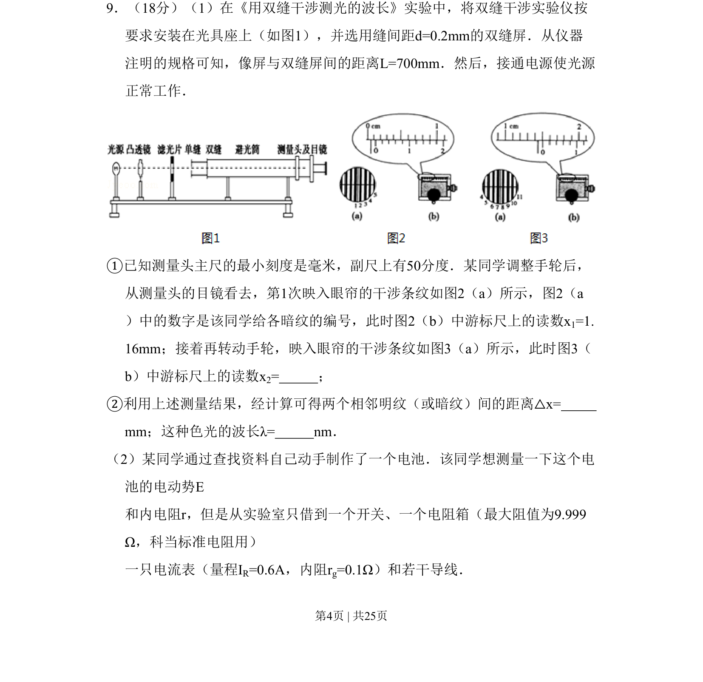
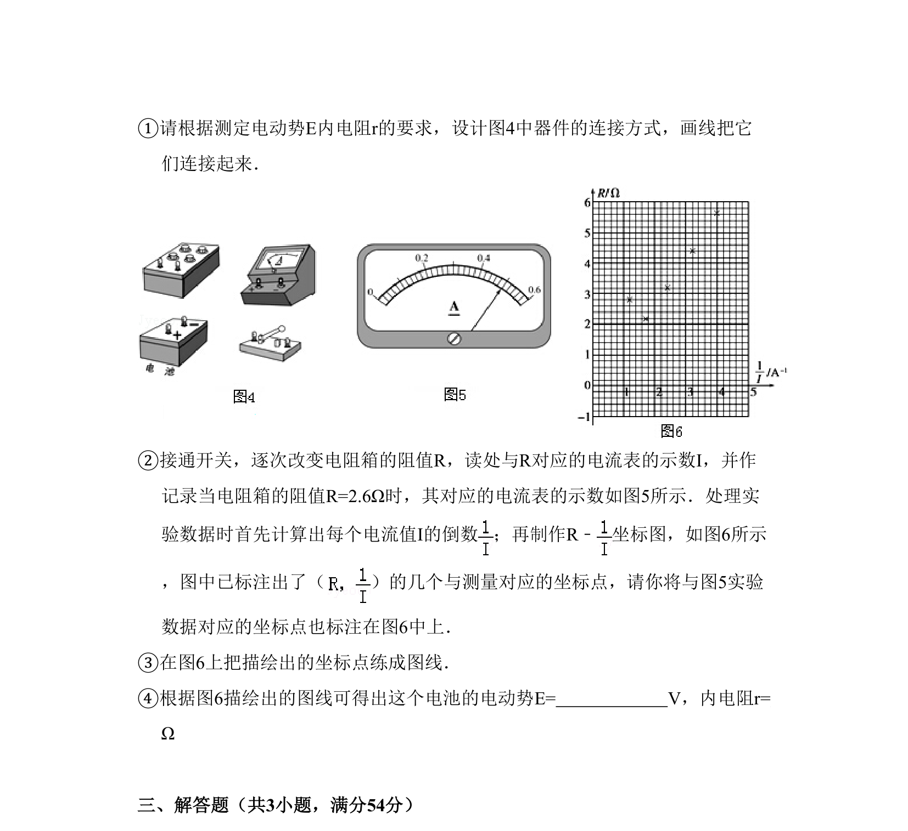

## 题面

## 摘要

双缝干涉测波长、测电源电动势和内阻两个实验的综合考查

## 关联考点

- [[552-双缝干涉|双缝干涉]]
- [[波长测量]]
- [[848-游标卡尺读数|游标卡尺读数]]
- [[测电源电动势和内阻]]

## 答案与解析

> 📄 原 PDF 第 4 页：`素材/真题/北京/2008-2024·（北京）物理高考真题/2009年高考物理试卷（北京）（解析卷）.pdf`

<!-- 题干文本-start -->
## 题干文本
9．（18分）（1）在《用双缝干涉测光的波长》实验中，将双缝干涉实验仪按
要求安装在光具座上（如图1），并选用缝间距d=0.2mm的双缝屏．从仪器
注明的规格可知，像屏与双缝屏间的距离L=700mm．然后，接通电源使光源
正常工作．
①已知测量头主尺的最小刻度是毫米，副尺上有50分度．某同学调整手轮后，
从测量头的目镜看去，第1次映入眼帘的干涉条纹如图2（a）所示，图2（a
）中的数字是该同学给各暗纹的编号，此时图2（b）中游标尺上的读数x1=1.
16mm；接着再转动手轮，映入眼帘的干涉条纹如图3（a）所示，此时图3（
b）中游标尺上的读数x2=　   　；
②利用上述测量结果，经计算可得两个相邻明纹（或暗纹）间的距离△x=　   　
mm；这种色光的波长λ=　   　nm．
（2）某同学通过查找资料自己动手制作了一个电池．该同学想测量一下这个电
池的电动势E 
和内电阻r，但是从实验室只借到一个开关、一个电阻箱（最大阻值为9.999
Ω，科当标准电阻用） 
一只电流表（量程IR=0.6A，内阻rg=0.1Ω）和若干导线．
<!-- 题干文本-end -->

<!-- 解析文本-start -->
## 解析文本

<!-- 解析文本-end -->
