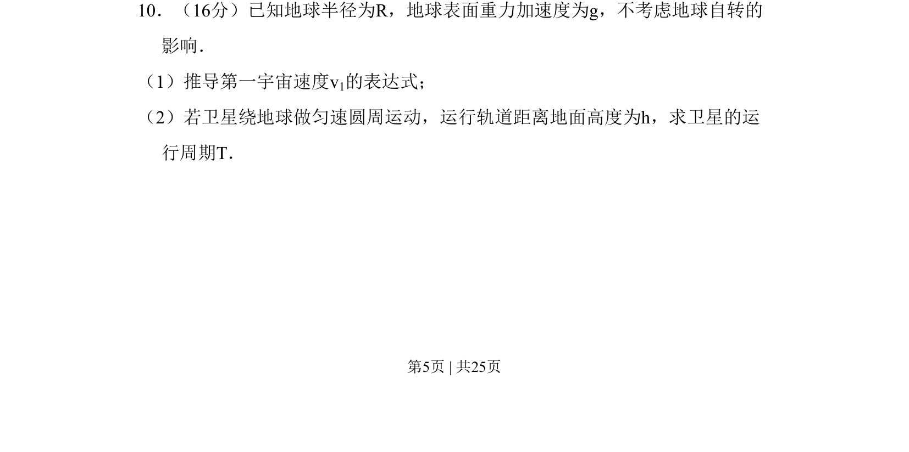

## 题面

## 摘要

推导第一宇宙速度表达式，并计算卫星在高度h处的运行周期。

## 关联考点

- [[246-万有引力定律|万有引力定律]]
- [[561-向心力公式|向心力公式]]
- [[281-第一宇宙速度|第一宇宙速度]]
- [[卫星周期]]

## 答案与解析

> 📄 原 PDF 第 5 页：`素材/真题/北京/2008-2024·（北京）物理高考真题/2009年高考物理试卷（北京）（解析卷）.pdf`
