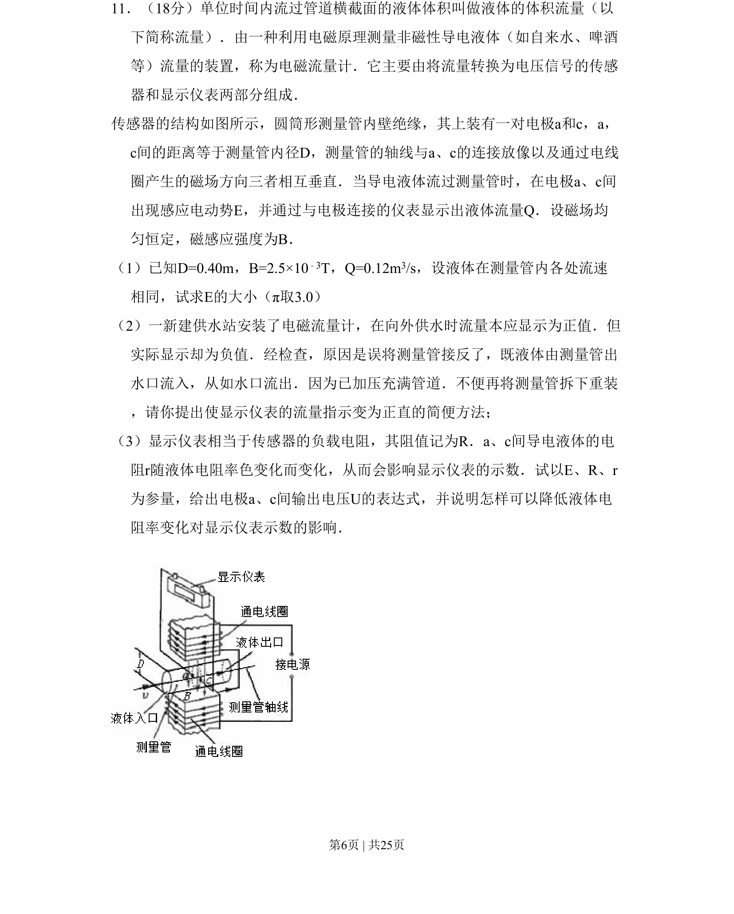

## 题面

## 摘要

电磁流量计原理，应用电磁感应测流量，涉及感应电动势计算、测量误差校正及输出表达式推导。

## 关联考点

- [[175-电磁感应|电磁感应]]
- [[流量]]
- [[332-闭合电路欧姆定律|闭合电路欧姆定律]]
- [[传感器]]

## 答案与解析

> 📄 原 PDF 第 6 页：`素材/真题/北京/2008-2024·（北京）物理高考真题/2009年高考物理试卷（北京）（解析卷）.pdf`
