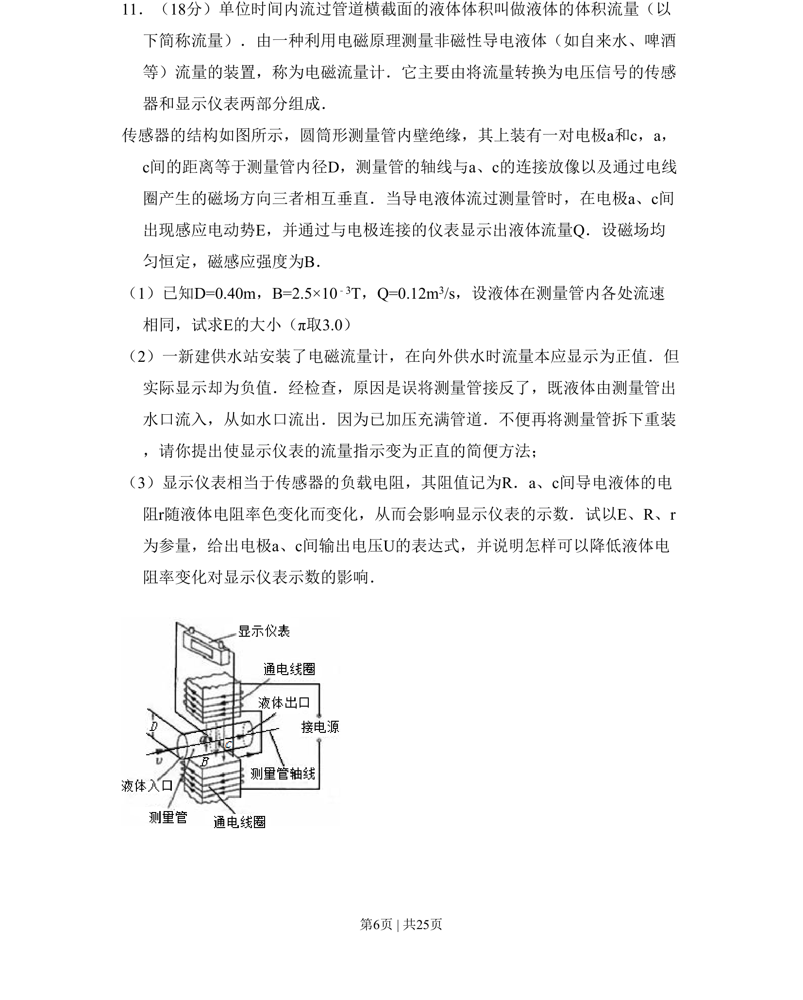

## 题面

## 摘要

电磁流量计原理，应用电磁感应测流量，涉及感应电动势计算、测量误差校正及输出表达式推导。

## 关联考点

- [[175-电磁感应|电磁感应]]
- [[流量]]
- [[332-闭合电路欧姆定律|闭合电路欧姆定律]]
- [[传感器]]

## 答案与解析

> 📄 原 PDF 第 6 页：`素材/真题/北京/2008-2024·（北京）物理高考真题/2009年高考物理试卷（北京）（解析卷）.pdf`

<!-- 题干文本-start -->
## 题干文本
11．（18分）单位时间内流过管道横截面的液体体积叫做液体的体积流量（以
下简称流量）．由一种利用电磁原理测量非磁性导电液体（如自来水、啤酒
等）流量的装置，称为电磁流量计．它主要由将流量转换为电压信号的传感
器和显示仪表两部分组成．
传感器的结构如图所示，圆筒形测量管内壁绝缘，其上装有一对电极a和c，a，
c间的距离等于测量管内径D，测量管的轴线与a、c的连接放像以及通过电线
圈产生的磁场方向三者相互垂直．当导电液体流过测量管时，在电极a、c间
出现感应电动势E，并通过与电极连接的仪表显示出液体流量Q．设磁场均
匀恒定，磁感应强度为B．
（1）已知D=0.40m，B=2.5×10﹣3T，Q=0.12m3/s，设液体在测量管内各处流速
相同，试求E的大小（π取3.0）
（2）一新建供水站安装了电磁流量计，在向外供水时流量本应显示为正值．但
实际显示却为负值．经检查，原因是误将测量管接反了，既液体由测量管出
水口流入，从如水口流出．因为已加压充满管道．不便再将测量管拆下重装
，请你提出使显示仪表的流量指示变为正直的简便方法；
（3）显示仪表相当于传感器的负载电阻，其阻值记为R．a、c间导电液体的电
阻r随液体电阻率色变化而变化，从而会影响显示仪表的示数．试以E、R、r
为参量，给出电极a、c间输出电压U的表达式，并说明怎样可以降低液体电
阻率变化对显示仪表示数的影响．
<!-- 题干文本-end -->

<!-- 解析文本-start -->
## 解析文本

<!-- 解析文本-end -->
