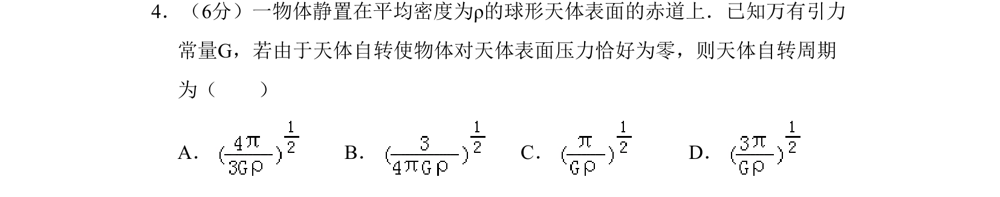

## 题面

## 摘要

物体静置在赤道，天体自转使压力为零，求自转周期。

## 关联考点

- [[246-万有引力定律|万有引力定律]]
- [[256-向心力|向心力]]
- [[天体自转]]
- [[506-临界条件|临界条件]]

## 答案与解析

> 📄 原 PDF 第 1 页：`素材/真题/北京/2008-2024·（北京）物理高考真题/2010年高考物理试卷（北京）（解析卷）.pdf`
