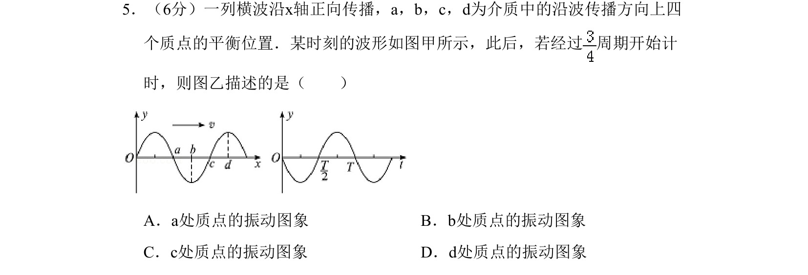

## 题面

## 摘要

根据波动图像和振动图像的关系，判断横波中质点经过特定时间后的振动情况。

## 关联考点

- [[363-横波与纵波|横波]]
- [[365-波的图象|波形图]]
- [[614-振动图象|振动图象]]
- [[765-质点振动方向|质点振动方向]]

## 答案与解析

> 📄 原 PDF 第 1 页：`素材/真题/北京/2008-2024·（北京）物理高考真题/2010年高考物理试卷（北京）（解析卷）.pdf`
