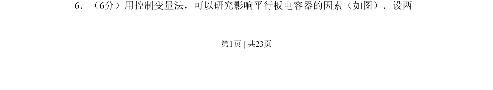
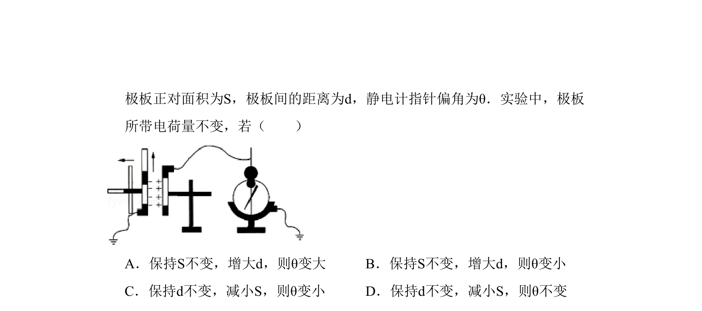

## 题面

## 摘要

考查平行板电容器电容的影响因素实验，采用控制变量法进行分析。

## 关联考点

- [[802-平行板电容器|平行板电容器]]
- [[312-电容|电容]]
- [[104-物理实验-控制变量法|控制变量法]]

## 答案与解析

> 📄 原 PDF 第 1 页：`素材/真题/北京/2008-2024·（北京）物理高考真题/2010年高考物理试卷（北京）（解析卷）.pdf`
