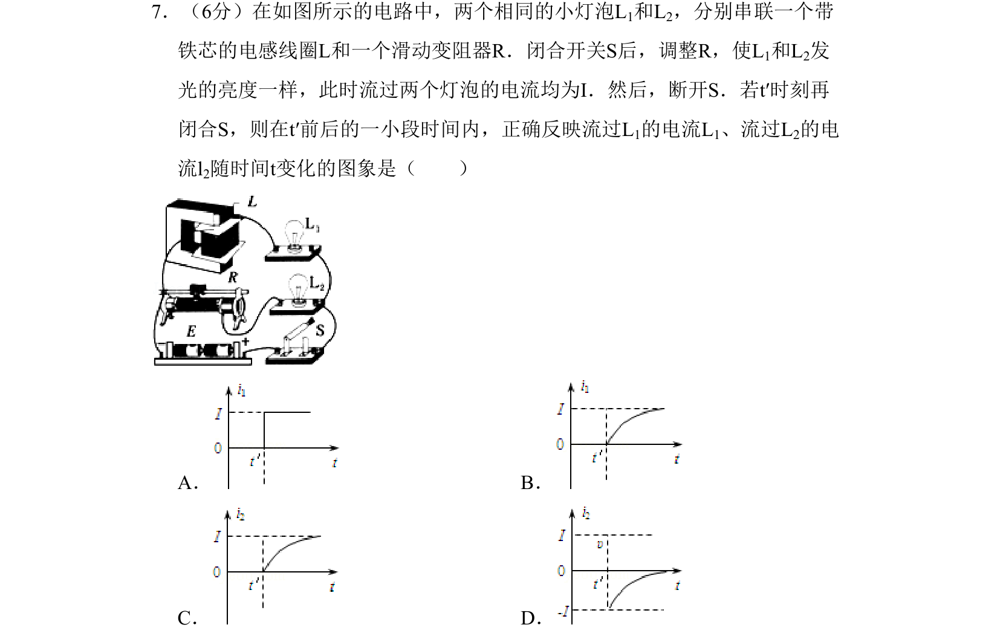

## 题面

## 摘要

考查含电感线圈的电路在开关闭合瞬间电流变化，自感电动势阻碍电流增大导致L1支路电流缓慢上升。

## 关联考点

- [[853-自感现象|自感现象]]
- [[电感对电流变化的阻碍]]
- [[电路暂态分析]]

## 答案与解析

> 📄 原 PDF 第 2 页：`素材/真题/北京/2008-2024·（北京）物理高考真题/2010年高考物理试卷（北京）（解析卷）.pdf`
