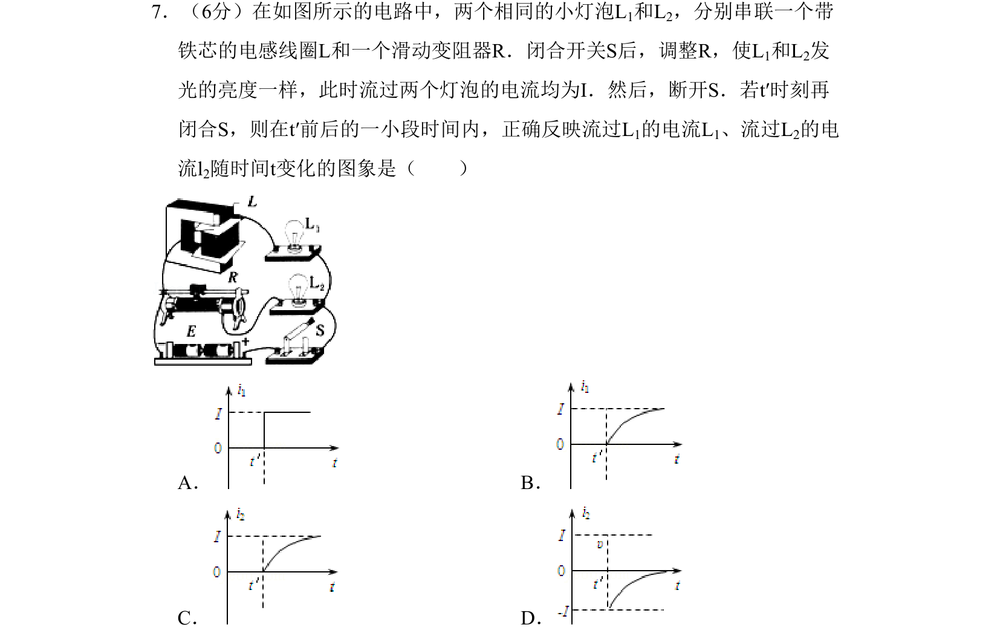

## 题面

## 摘要

考查含电感线圈的电路在开关闭合瞬间电流变化，自感电动势阻碍电流增大导致L1支路电流缓慢上升。

## 关联考点

- [[853-自感现象|自感现象]]
- [[电感对电流变化的阻碍]]
- [[电路暂态分析]]

## 答案与解析

> 📄 原 PDF 第 2 页：`素材/真题/北京/2008-2024·（北京）物理高考真题/2010年高考物理试卷（北京）（解析卷）.pdf`

<!-- 题干文本-start -->
## 题干文本
7．（6分）在如图所示的电路中，两个相同的小灯泡L1和L2，分别串联一个带
铁芯的电感线圈L和一个滑动变阻器R．闭合开关S后，调整R，使L1和L2发
光的亮度一样，此时流过两个灯泡的电流均为I．然后，断开S．若t′时刻再
闭合S，则在t′前后的一小段时间内，正确反映流过L1的电流L1、流过L2的电
流l2随时间t变化的图象是（　　）
A．B．
C．D．
<!-- 题干文本-end -->

<!-- 解析文本-start -->
## 解析文本

<!-- 解析文本-end -->
