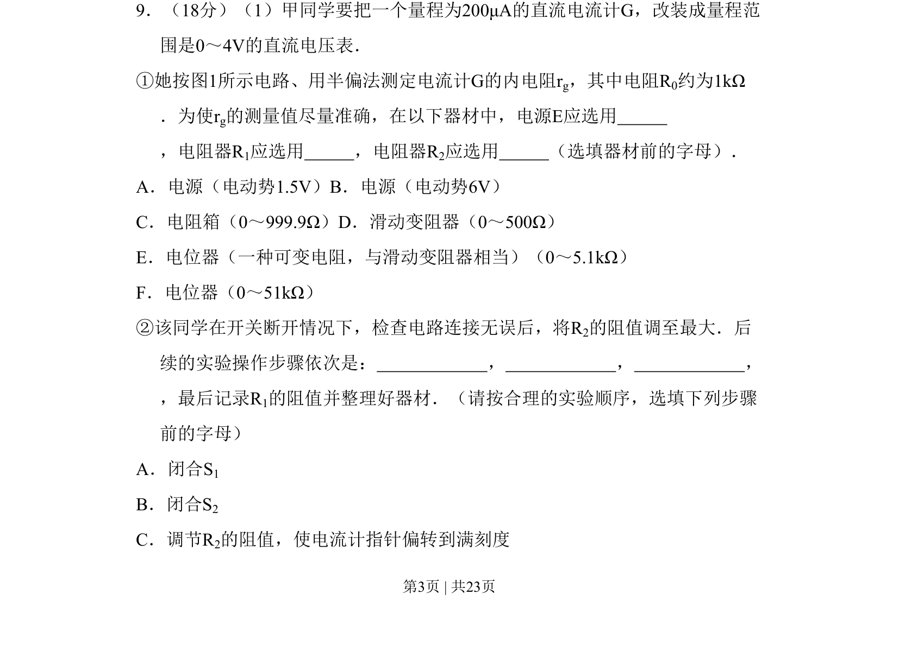
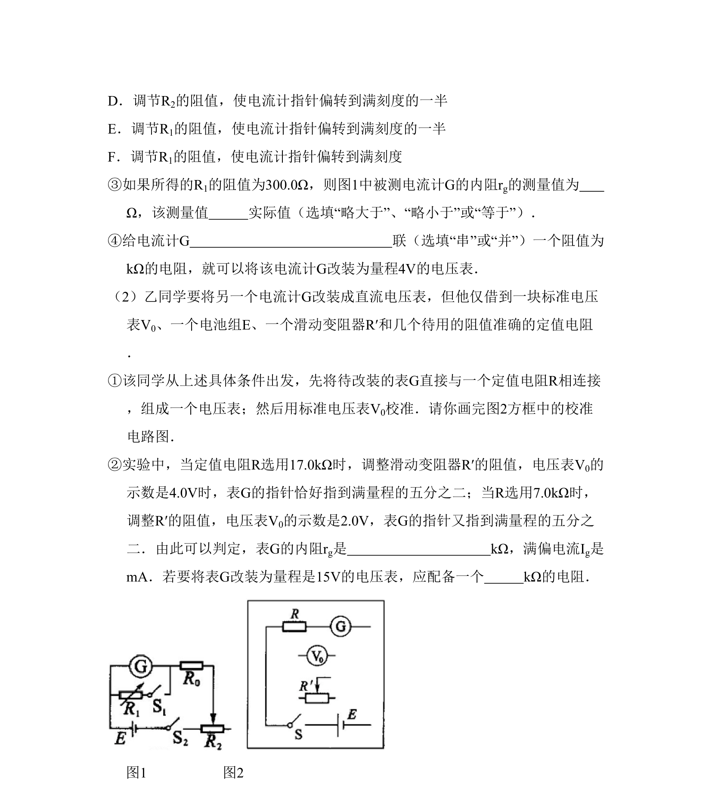

## 题面

## 摘要

考查半偏法测电流计内阻及改装电压表的实验步骤与器材选择

## 关联考点

- [[546-半偏法|半偏法]]
- [[690-电表改装|电表改装]]
- [[141-欧姆定律-初中|欧姆定律]]
- [[实验器材选择]]

## 答案与解析

> 📄 原 PDF 第 3 页：`素材/真题/北京/2008-2024·（北京）物理高考真题/2010年高考物理试卷（北京）（解析卷）.pdf`
