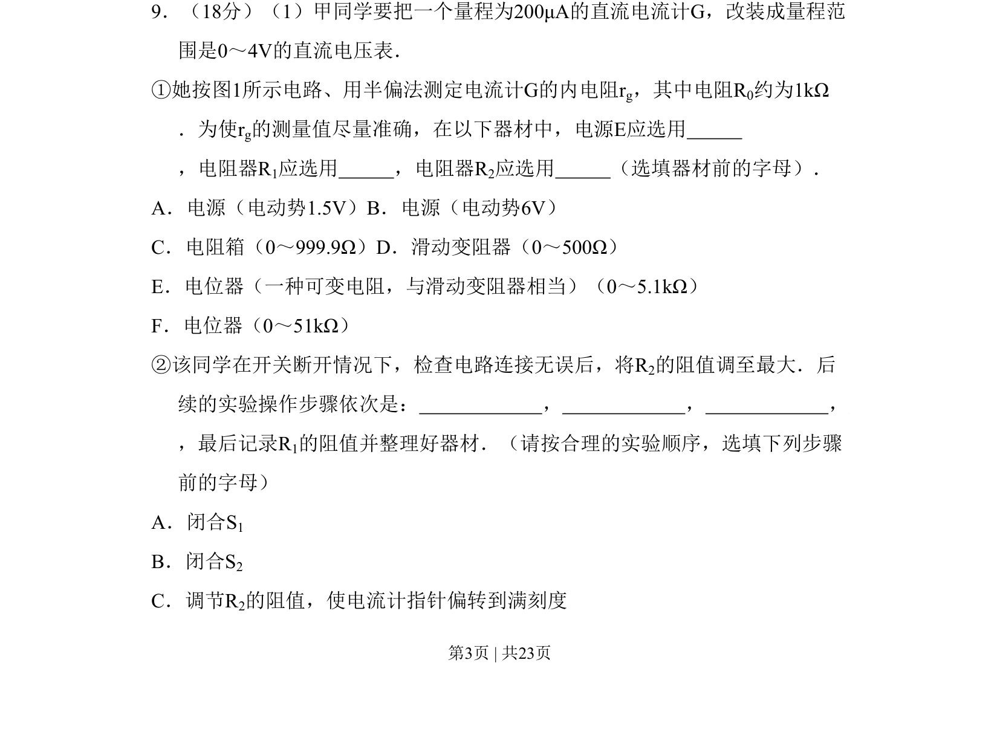
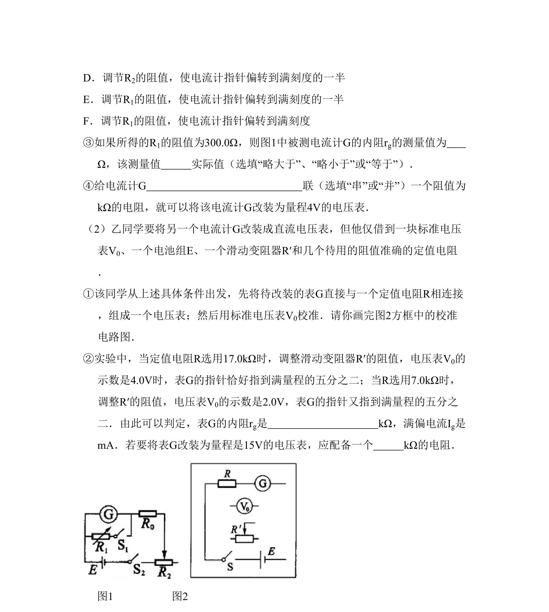

## 题面

## 摘要

考查半偏法测电流计内阻及改装电压表的实验步骤与器材选择

## 关联考点

- [[546-半偏法|半偏法]]
- [[690-电表改装|电表改装]]
- [[141-欧姆定律-初中|欧姆定律]]
- [[实验器材选择]]

## 答案与解析

> 📄 原 PDF 第 3 页：`素材/真题/北京/2008-2024·（北京）物理高考真题/2010年高考物理试卷（北京）（解析卷）.pdf`

<!-- 题干文本-start -->
## 题干文本
9．（18分）（1）甲同学要把一个量程为200μA的直流电流计G，改装成量程范
围是0～4V的直流电压表．
①她按图1所示电路、用半偏法测定电流计G的内电阻rg，其中电阻R0约为1kΩ
．为使rg的测量值尽量准确，在以下器材中，电源E应选用　   　
，电阻器R1应选用　   　，电阻器R2应选用　   　（选填器材前的字母）．
A．电源（电动势1.5V）B．电源（电动势6V）
C．电阻箱（0～999.9Ω）D．滑动变阻器（0～500Ω）
E．电位器（一种可变电阻，与滑动变阻器相当）（0～5.1kΩ）
F．电位器（0～51kΩ）
②该同学在开关断开情况下，检查电路连接无误后，将R2的阻值调至最大．后
续的实验操作步骤依次是：　   　，　   　，　   　，　   　
，最后记录R1的阻值并整理好器材．（请按合理的实验顺序，选填下列步骤
前的字母）
A．闭合S1
B．闭合S2
C．调节R2的阻值，使电流计指针偏转到满刻度
<!-- 题干文本-end -->

<!-- 解析文本-start -->
## 解析文本

<!-- 解析文本-end -->
