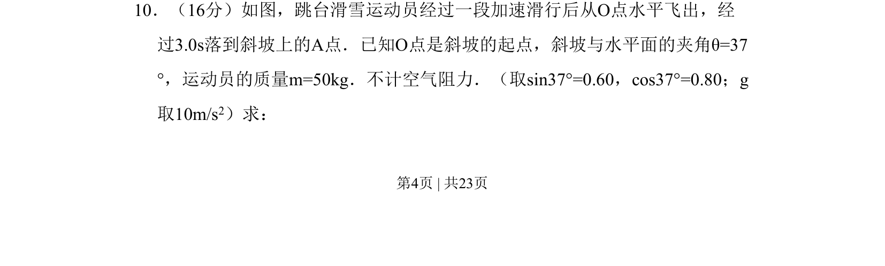
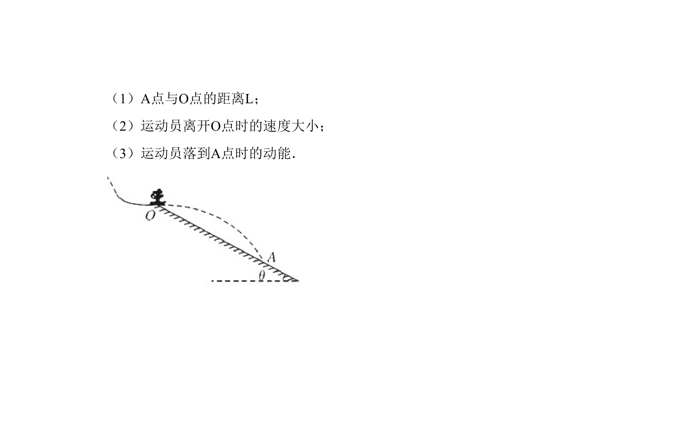

## 题面

## 摘要

平抛运动与斜面结合，由时间和角度求位移与速度。

## 关联考点

- [[261-平抛运动|平抛运动]]
- [[731-运动分解|运动分解]]
- [[位移偏转角]]
- [[几何约束]]

## 答案与解析

> 📄 原 PDF 第 4 页：`素材/真题/北京/2008-2024·（北京）物理高考真题/2010年高考物理试卷（北京）（解析卷）.pdf`

<!-- 题干文本-start -->
## 题干文本
10．（16分）如图，跳台滑雪运动员经过一段加速滑行后从O点水平飞出，经
过3.0s落到斜坡上的A点．已知O点是斜坡的起点，斜坡与水平面的夹角θ=37
°，运动员的质量m=50kg．不计空气阻力．（取sin37°=0.60，cos37°=0.80；g
取10m/s2）求：
<!-- 题干文本-end -->

<!-- 解析文本-start -->
## 解析文本

<!-- 解析文本-end -->
