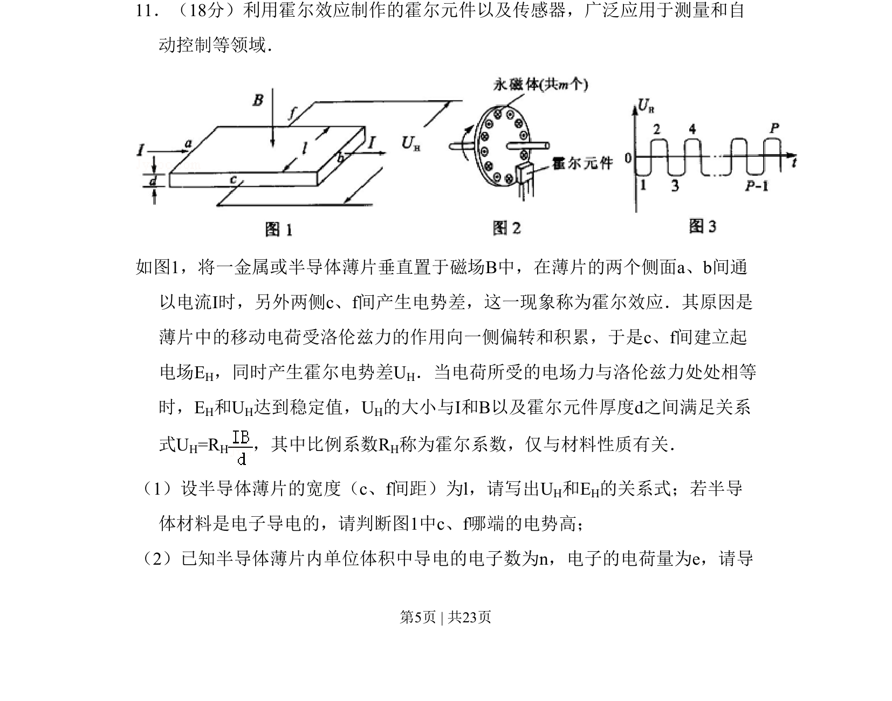
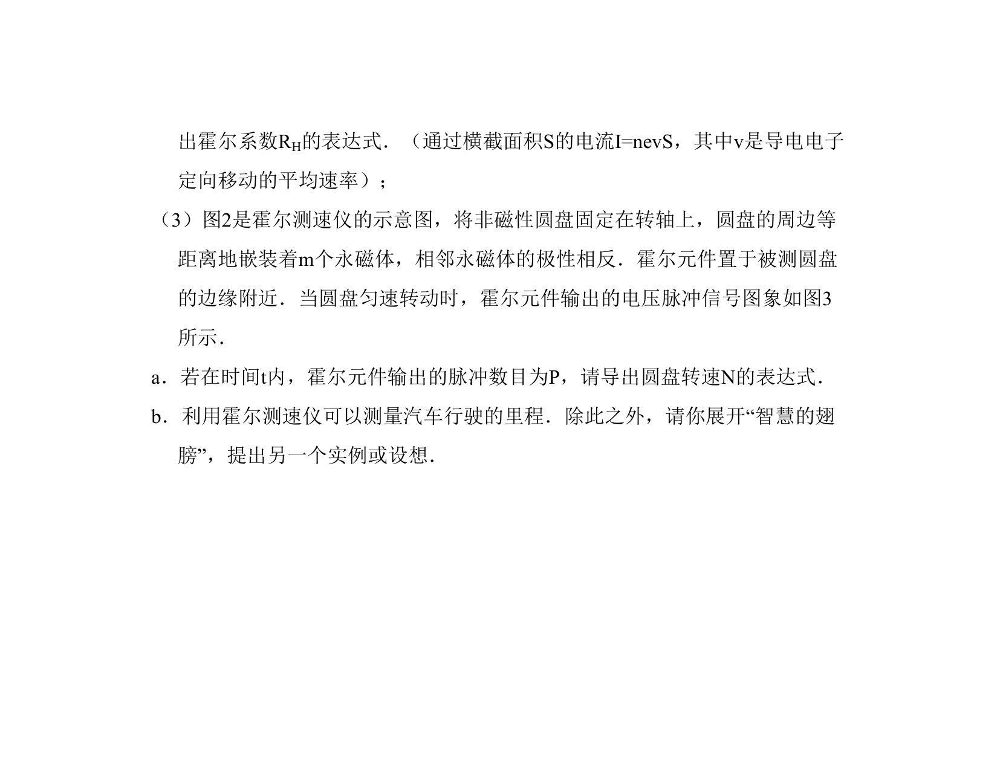

## 题面

## 摘要

考查霍尔效应原理及霍尔电压与电场关系，要求推导关系式并判断电子导电时电势高低。

## 关联考点

- [[333-霍尔效应|霍尔效应]]
- [[304-洛伦兹力|洛伦兹力]]
- [[672-电场力|电场力]]
- [[163-电压|电势差]]

## 答案与解析

> 📄 原 PDF 第 5 页：`素材/真题/北京/2008-2024·（北京）物理高考真题/2010年高考物理试卷（北京）（解析卷）.pdf`
