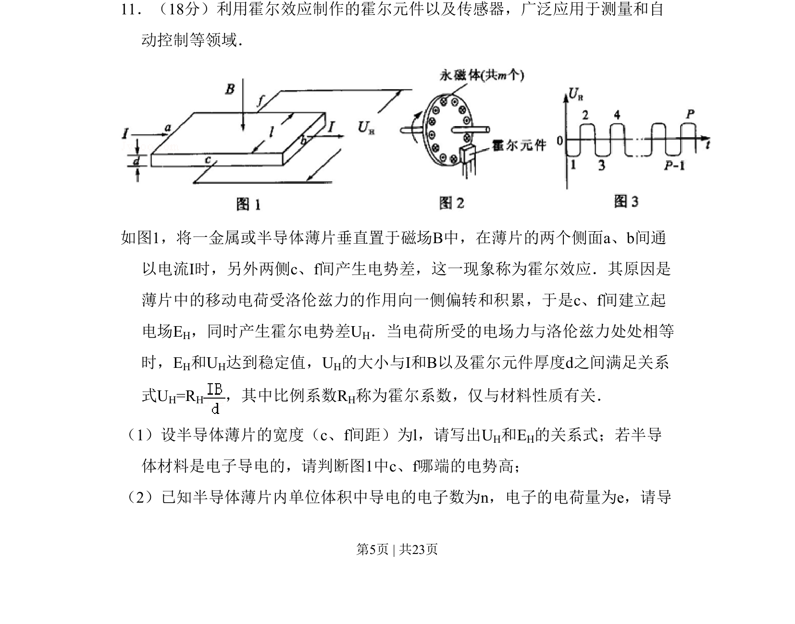
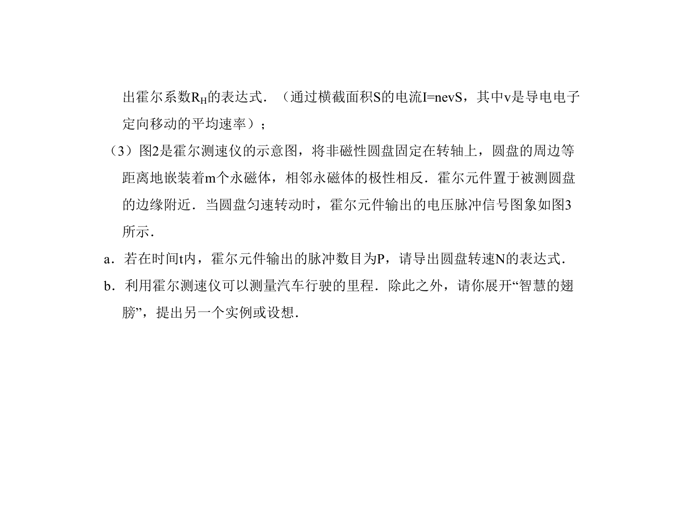

## 题面

## 摘要

考查霍尔效应原理及霍尔电压与电场关系，要求推导关系式并判断电子导电时电势高低。

## 关联考点

- [[333-霍尔效应|霍尔效应]]
- [[304-洛伦兹力|洛伦兹力]]
- [[672-电场力|电场力]]
- [[163-电压|电势差]]

## 答案与解析

> 📄 原 PDF 第 5 页：`素材/真题/北京/2008-2024·（北京）物理高考真题/2010年高考物理试卷（北京）（解析卷）.pdf`

<!-- 题干文本-start -->
## 题干文本
11．（18分）利用霍尔效应制作的霍尔元件以及传感器，广泛应用于测量和自
动控制等领域．
如图1，将一金属或半导体薄片垂直置于磁场B中，在薄片的两个侧面a、b间通
以电流I时，另外两侧c、f间产生电势差，这一现象称为霍尔效应．其原因是
薄片中的移动电荷受洛伦兹力的作用向一侧偏转和积累，于是c、f间建立起
电场EH，同时产生霍尔电势差UH．当电荷所受的电场力与洛伦兹力处处相等
时，EH和UH达到稳定值，UH的大小与I和B以及霍尔元件厚度d之间满足关系
式UH=RH ，其中比例系数RH称为霍尔系数，仅与材料性质有关．
（1）设半导体薄片的宽度（c、f间距）为l，请写出UH和EH的关系式；若半导
体材料是电子导电的，请判断图1中c、f哪端的电势高；
（2）已知半导体薄片内单位体积中导电的电子数为n，电子的电荷量为e，请导
<!-- 题干文本-end -->

<!-- 解析文本-start -->
## 解析文本

<!-- 解析文本-end -->
