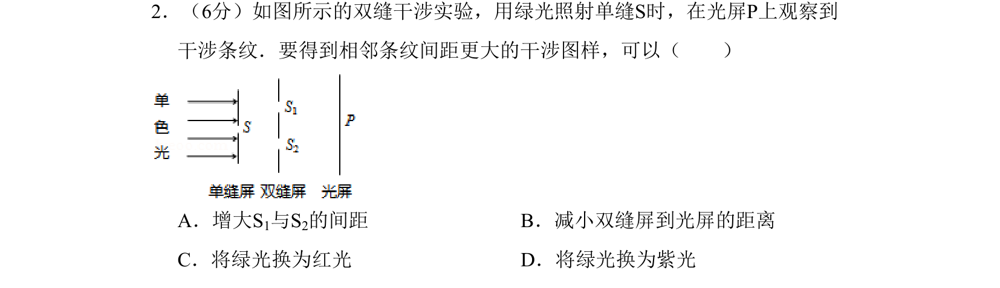

## 题面

## 摘要

考查双缝干涉中相邻条纹间距的影响因素及变化判断。

## 关联考点

- [[552-双缝干涉|双缝干涉]]
- [[627-条纹间距|条纹间距]]
- [[370-波长|波长]]

## 答案与解析

> 📄 原 PDF 第 1 页：`素材/真题/北京/2008-2024·（北京）物理高考真题/2011年高考物理试卷（北京）（解析卷）.pdf`

<!-- 题干文本-start -->
## 题干文本
2．（6分）如图所示的双缝干涉实验，用绿光照射单缝S时，在光屏P上观察到
干涉条纹．要得到相邻条纹间距更大的干涉图样，可以（　　）
A．增大S1与S2的间距B．减小双缝屏到光屏的距离
C．将绿光换为红光D．将绿光换为紫光
<!-- 题干文本-end -->

<!-- 解析文本-start -->
## 解析文本

<!-- 解析文本-end -->
