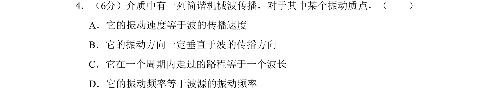

## 题面

## 摘要

考查机械波中质点振动与波传播的区别，辨析振动速度、波速、路程与波长等概念。

## 关联考点

- [[852-简谐波|简谐波]]
- [[763-质点振动|质点振动]]
- [[369-波速|波速]]
- [[370-波长|波长]]
- [[143-频数分布|频率]]

## 答案与解析

> 📄 原 PDF 第 1 页：`素材/真题/北京/2008-2024·（北京）物理高考真题/2011年高考物理试卷（北京）（解析卷）.pdf`
