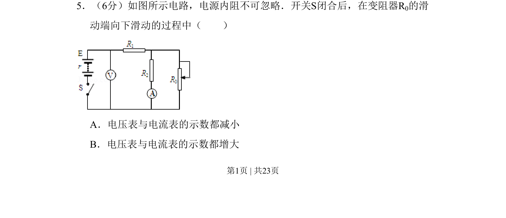

## 题面

## 摘要

闭合电路动态分析，滑动变阻器滑片下移引起总电阻变化，判断电表示数变化。

## 关联考点

- [[332-闭合电路欧姆定律|闭合电路欧姆定律]]
- [[504-串并联电路|串并联电路]]
- [[792-动态电路分析|动态电路分析]]

## 答案与解析

> 📄 原 PDF 第 1 页：`素材/真题/北京/2008-2024·（北京）物理高考真题/2011年高考物理试卷（北京）（解析卷）.pdf`
