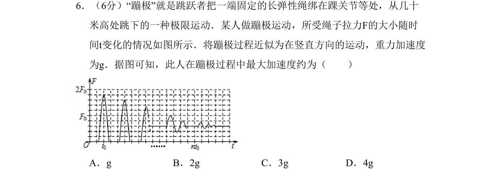

## 题面

## 摘要

通过拉力时间图像分析蹦极运动的最大加速度，结合牛顿第二定律求解。

## 关联考点

- [[229-牛顿第二定律|牛顿第二定律]]
- [[力与运动图像]]
- [[临界状态分析]]

## 答案与解析

> 📄 原 PDF 第 2 页：`素材/真题/北京/2008-2024·（北京）物理高考真题/2011年高考物理试卷（北京）（解析卷）.pdf`

<!-- 题干文本-start -->
## 题干文本
6．（6分）“蹦极”就是跳跃者把一端固定的长弹性绳绑在踝关节等处，从几十
米高处跳下的一种极限运动．某人做蹦极运动，所受绳子拉力F的大小随时
间t变化的情况如图所示．将蹦极过程近似为在竖直方向的运动，重力加速度
为g．据图可知，此人在蹦极过程中最大加速度约为（　　）
A．g B．2g C．3g D．4g
<!-- 题干文本-end -->

<!-- 解析文本-start -->
## 解析文本

<!-- 解析文本-end -->
