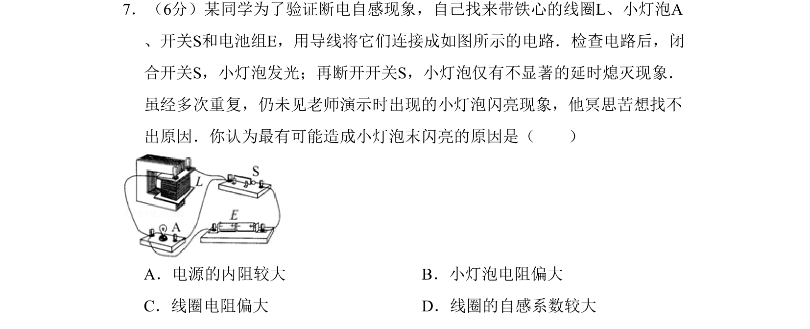

## 题面

## 摘要

本题考查断电自感现象中小灯泡未闪亮的原因分析，涉及线圈与小灯泡的电阻匹配问题。

## 关联考点

- [[853-自感现象|自感现象]]
- [[断电自感]]
- [[694-电路分析|电路分析]]
- [[电阻匹配]]

## 答案与解析

> 📄 原 PDF 第 2 页：`素材/真题/北京/2008-2024·（北京）物理高考真题/2011年高考物理试卷（北京）（解析卷）.pdf`
