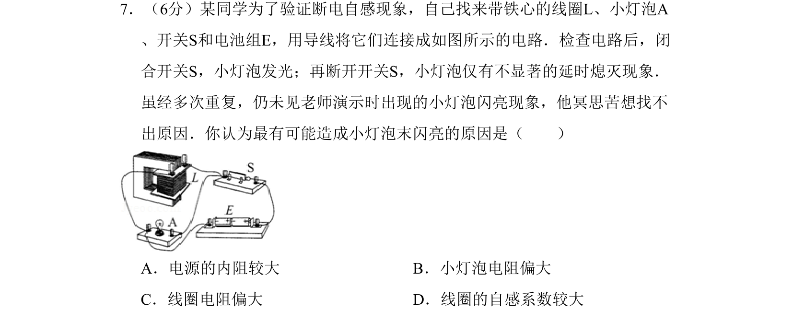

## 题面

## 摘要

本题考查断电自感现象中小灯泡未闪亮的原因分析，涉及线圈与小灯泡的电阻匹配问题。

## 关联考点

- [[853-自感现象|自感现象]]
- [[断电自感]]
- [[693-电路分析|电路分析]]
- [[电阻匹配]]

## 答案与解析

> 📄 原 PDF 第 2 页：`素材/真题/北京/2008-2024·（北京）物理高考真题/2011年高考物理试卷（北京）（解析卷）.pdf`

<!-- 题干文本-start -->
## 题干文本
7．（6分）某同学为了验证断电自感现象，自己找来带铁心的线圈L、小灯泡A
、开关S和电池组E，用导线将它们连接成如图所示的电路．检查电路后，闭
合开关S，小灯泡发光；再断开开关S，小灯泡仅有不显著的延时熄灭现象．
虽经多次重复，仍未见老师演示时出现的小灯泡闪亮现象，他冥思苦想找不
出原因．你认为最有可能造成小灯泡末闪亮的原因是（　　）
A．电源的内阻较大B．小灯泡电阻偏大
C．线圈电阻偏大D．线圈的自感系数较大
<!-- 题干文本-end -->

<!-- 解析文本-start -->
## 解析文本

<!-- 解析文本-end -->
