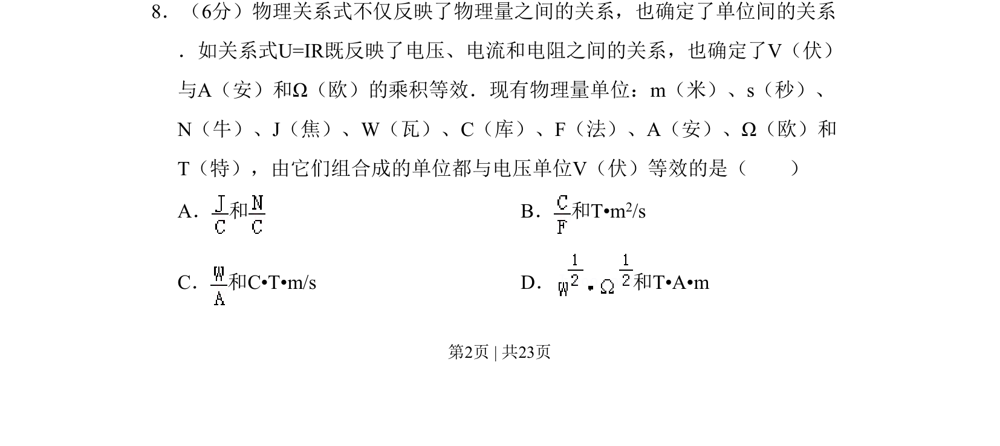

## 题面

## 摘要

考查物理量单位制与量纲分析，通过导出单位判断与电压单位等效的组合。

## 关联考点

- [[830-单位制|单位制]]
- [[832-量纲分析|量纲分析]]
- [[电磁学单位]]

## 答案与解析

> 📄 原 PDF 第 2 页：`素材/真题/北京/2008-2024·（北京）物理高考真题/2011年高考物理试卷（北京）（解析卷）.pdf`

<!-- 题干文本-start -->
## 题干文本
8．（6分）物理关系式不仅反映了物理量之间的关系，也确定了单位间的关系
．如关系式U=IR既反映了电压、电流和电阻之间的关系，也确定了V（伏）
与A（安）和Ω（欧）的乘积等效．现有物理量单位：m（米）、s（秒）、
N（牛）、J（焦）、W（瓦）、C（库）、F（法）、A（安）、Ω（欧）和
T（特），由它们组合成的单位都与电压单位V（伏）等效的是（　　）
A． 和B． 和T•m 2/s
C． 和C•T•m/s D． 和T•A•m
<!-- 题干文本-end -->

<!-- 解析文本-start -->
## 解析文本

<!-- 解析文本-end -->
