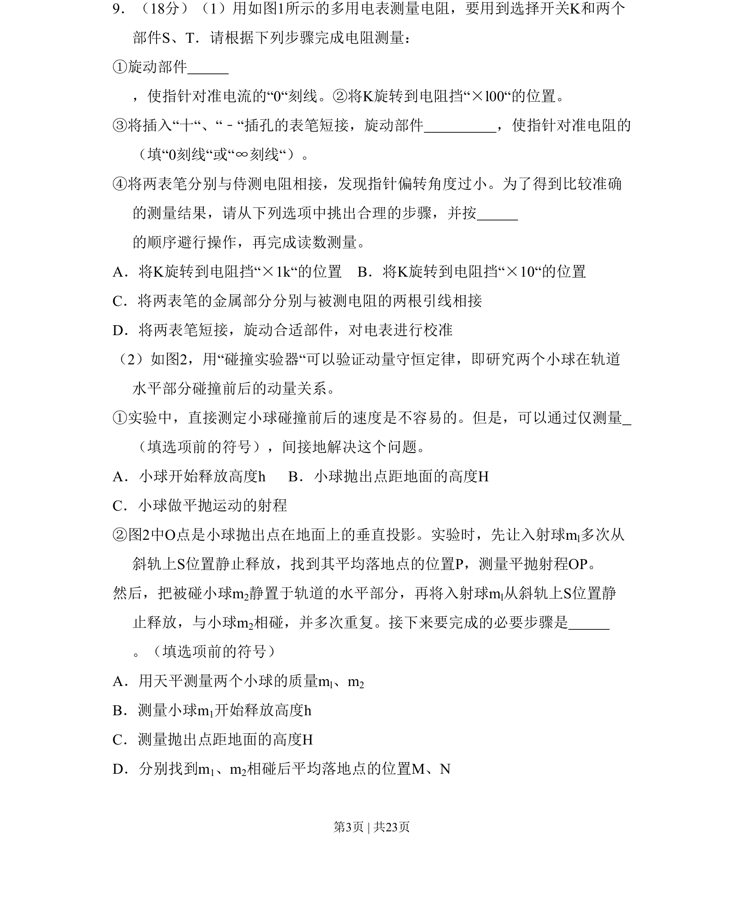
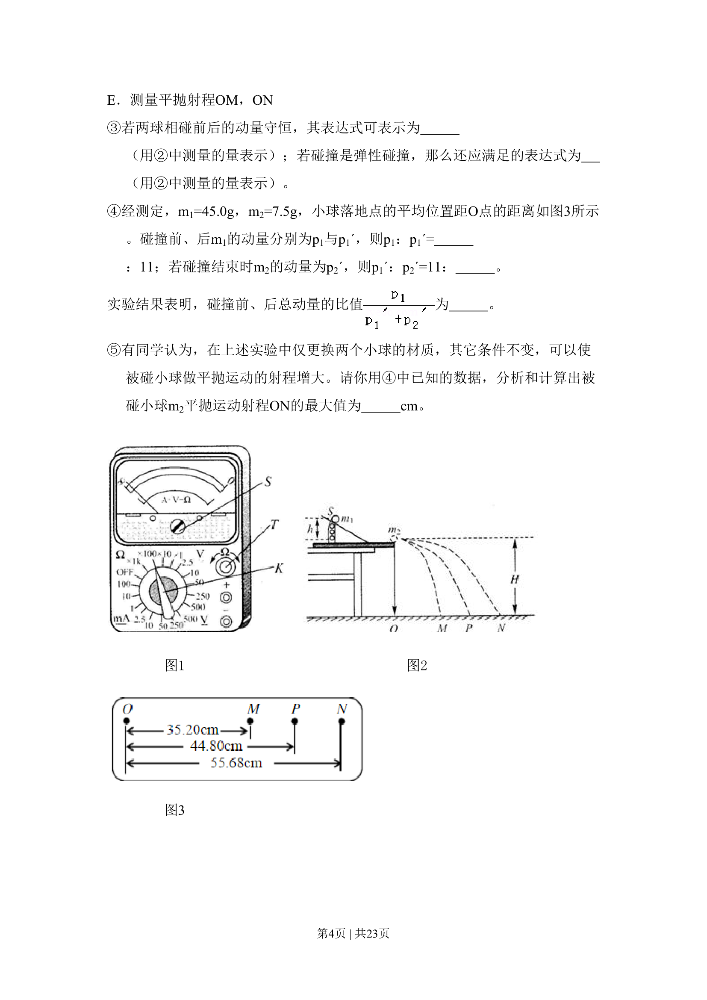

## 题面

## 摘要

考查多用电表欧姆挡操作步骤及用平抛法验证动量守恒定律的实验方法

## 关联考点

- [[784-多用电表的使用|多用电表的使用]]
- [[631-欧姆调零|欧姆调零]]
- [[动量守恒定律验证]]
- [[261-平抛运动|平抛运动]]

## 答案与解析

> 📄 原 PDF 第 3 页：`素材/真题/北京/2008-2024·（北京）物理高考真题/2011年高考物理试卷（北京）（解析卷）.pdf`
