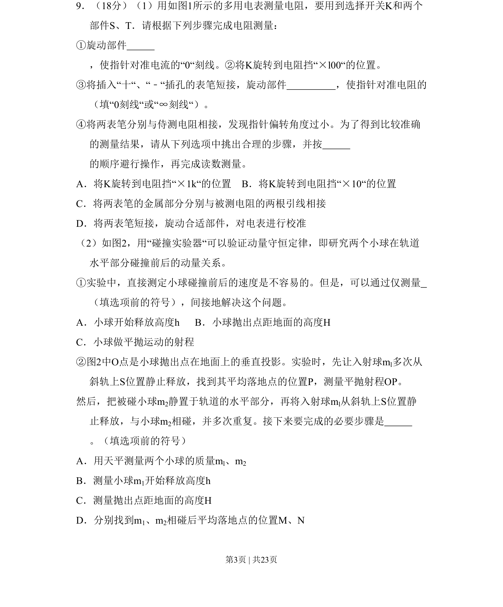
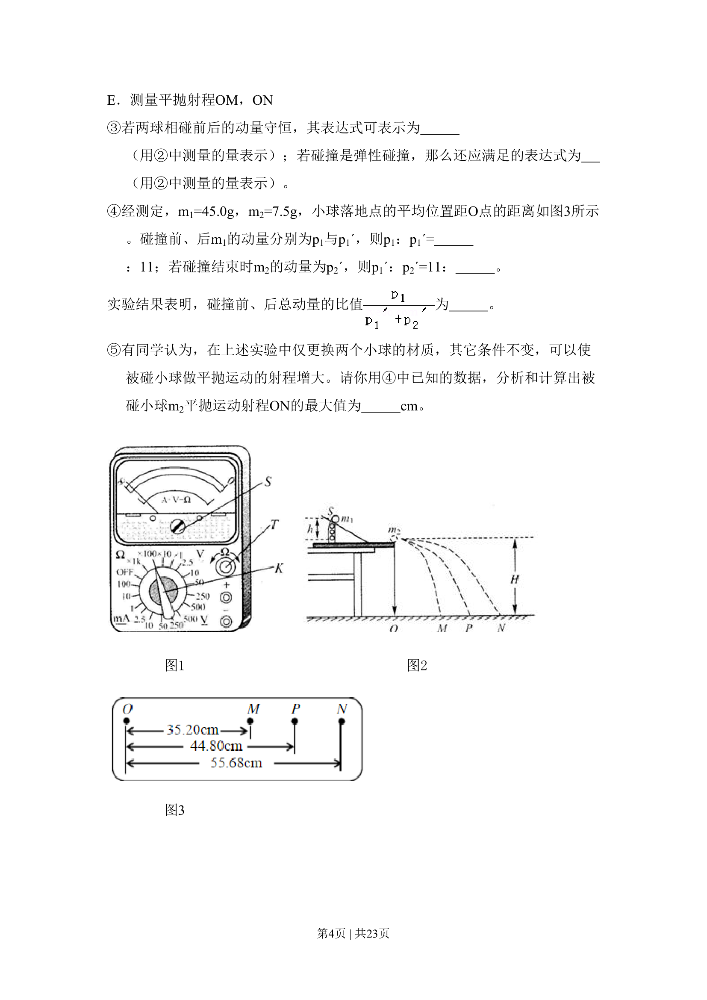

## 题面

## 摘要

考查多用电表欧姆挡操作步骤及用平抛法验证动量守恒定律的实验方法

## 关联考点

- [[784-多用电表的使用|多用电表的使用]]
- [[631-欧姆调零|欧姆调零]]
- [[动量守恒定律验证]]
- [[261-平抛运动|平抛运动]]

## 答案与解析

> 📄 原 PDF 第 3 页：`素材/真题/北京/2008-2024·（北京）物理高考真题/2011年高考物理试卷（北京）（解析卷）.pdf`

<!-- 题干文本-start -->
## 题干文本
9．（18分）（1）用如图1所示的多用电表测量电阻，要用到选择开关K和两个
部件S、T．请根据下列步骤完成电阻测量：
①旋动部件　   　
，使指针对准电流的“0“刻线。②将K旋转到电阻挡“×l00“的位置。
③将插入“十“、“﹣“插孔的表笔短接，旋动部件　   　，使指针对准电阻的　   　
（填“0刻线“或“∞刻线“）。
④将两表笔分别与侍测电阻相接，发现指针偏转角度过小。为了得到比较准确
的测量结果，请从下列选项中挑出合理的步骤，并按　   　
的顺序避行操作，再完成读数测量。
A．将K旋转到电阻挡“×1k“的位置    B．将K旋转到电阻挡“×10“的位置
C．将两表笔的金属部分分别与被测电阻的两根引线相接
D．将两表笔短接，旋动合适部件，对电表进行校准
（2）如图2，用“碰撞实验器“可以验证动量守恒定律，即研究两个小球在轨道
水平部分碰撞前后的动量关系。
①实验中，直接测定小球碰撞前后的速度是不容易的。但是，可以通过仅测量　   　
（填选项前的符号），间接地解决这个问题。
A．小球开始释放高度h      B．小球抛出点距地面的高度H
C．小球做平抛运动的射程
②图2中O点是小球抛出点在地面上的垂直投影。实验时，先让入射球ml多次从
斜轨上S位置静止释放，找到其平均落地点的位置P，测量平抛射程OP。
然后，把被碰小球m2静置于轨道的水平部分，再将入射球ml从斜轨上S位置静
止释放，与小球m2相碰，并多次重复。接下来要完成的必要步骤是　   　
。（填选项前的符号）
A．用天平测量两个小球的质量ml、m2
B．测量小球m1开始释放高度h   
C．测量抛出点距地面的高度H
D．分别找到m1、m2相碰后平均落地点的位置M、N
<!-- 题干文本-end -->

<!-- 解析文本-start -->
## 解析文本

<!-- 解析文本-end -->
