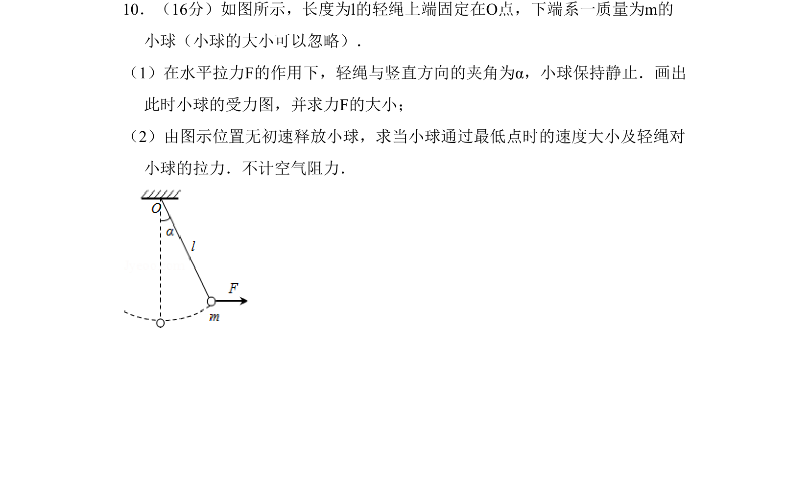

## 题面

## 摘要

轻绳连接小球在水平拉力下平衡及释放后摆动，考查受力分析与牛顿定律、动能定理、圆周运动向心力。

## 关联考点

- [[208-共点力平衡|共点力平衡]]
- [[229-牛顿第二定律|牛顿第二定律]]
- [[251-动能定理|动能定理]]
- [[256-向心力|向心力]]

## 答案与解析

> 📄 原 PDF 第 5 页：`素材/真题/北京/2008-2024·（北京）物理高考真题/2011年高考物理试卷（北京）（解析卷）.pdf`
