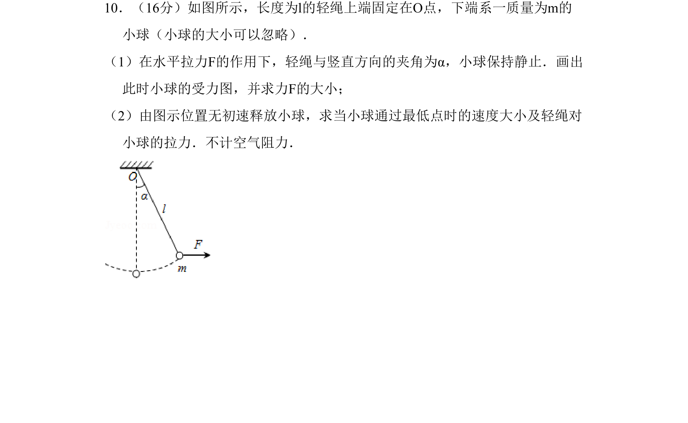

## 题面

## 摘要

轻绳连接小球在水平拉力下平衡及释放后摆动，考查受力分析与牛顿定律、动能定理、圆周运动向心力。

## 关联考点

- [[208-共点力平衡|共点力平衡]]
- [[229-牛顿第二定律|牛顿第二定律]]
- [[251-动能定理|动能定理]]
- [[256-向心力|向心力]]

## 答案与解析

> 📄 原 PDF 第 5 页：`素材/真题/北京/2008-2024·（北京）物理高考真题/2011年高考物理试卷（北京）（解析卷）.pdf`

<!-- 题干文本-start -->
## 题干文本
10．（16分）如图所示，长度为l的轻绳上端固定在O点，下端系一质量为m的
小球（小球的大小可以忽略）．
（1）在水平拉力F的作用下，轻绳与竖直方向的夹角为α，小球保持静止．画出
此时小球的受力图，并求力F的大小；
（2）由图示位置无初速释放小球，求当小球通过最低点时的速度大小及轻绳对
小球的拉力．不计空气阻力．
<!-- 题干文本-end -->

<!-- 解析文本-start -->
## 解析文本

<!-- 解析文本-end -->
