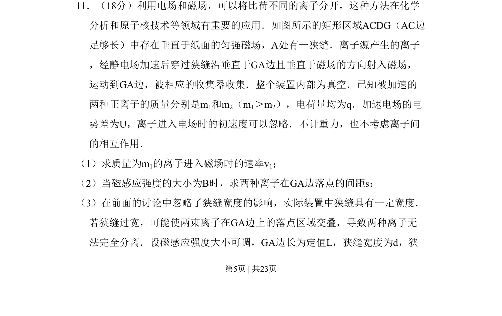
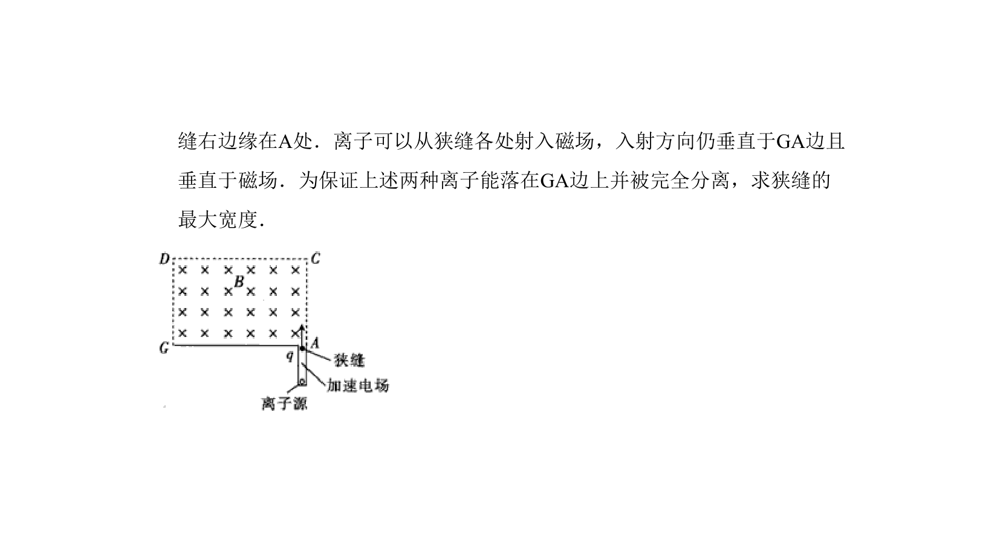

## 题面

## 摘要

电场加速与磁场偏转实现离子分离，计算入射速率、落点间距及狭缝宽度对分离的影响。

## 关联考点

- [[251-动能定理|动能定理]]
- [[带电粒子在匀强磁场中的圆周运动]]
- [[456-几何关系|几何关系]]
- [[离子分离条件]]

## 答案与解析

> 📄 原 PDF 第 5 页：`素材/真题/北京/2008-2024·（北京）物理高考真题/2011年高考物理试卷（北京）（解析卷）.pdf`
