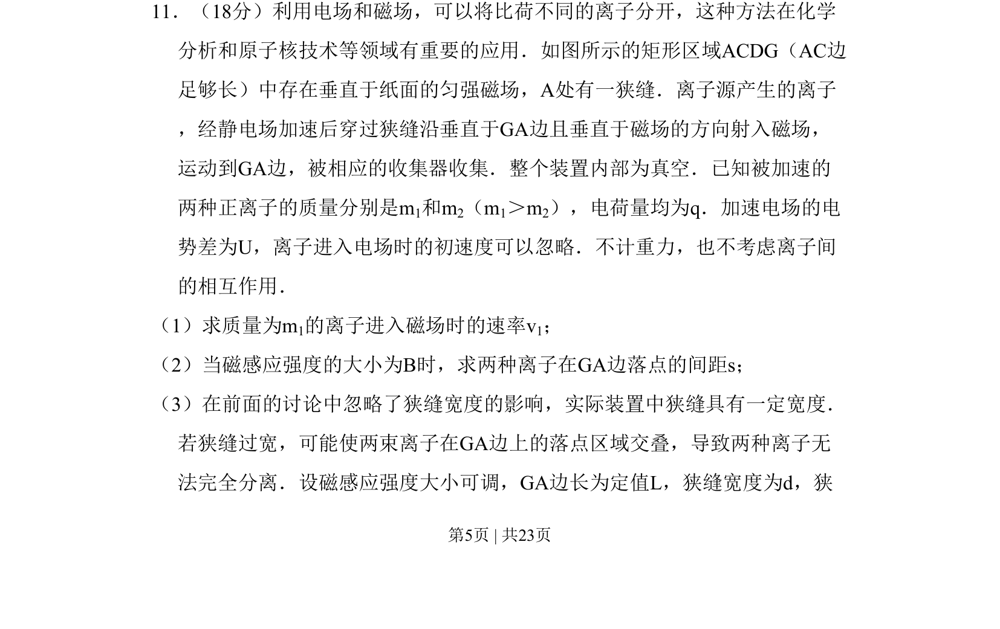
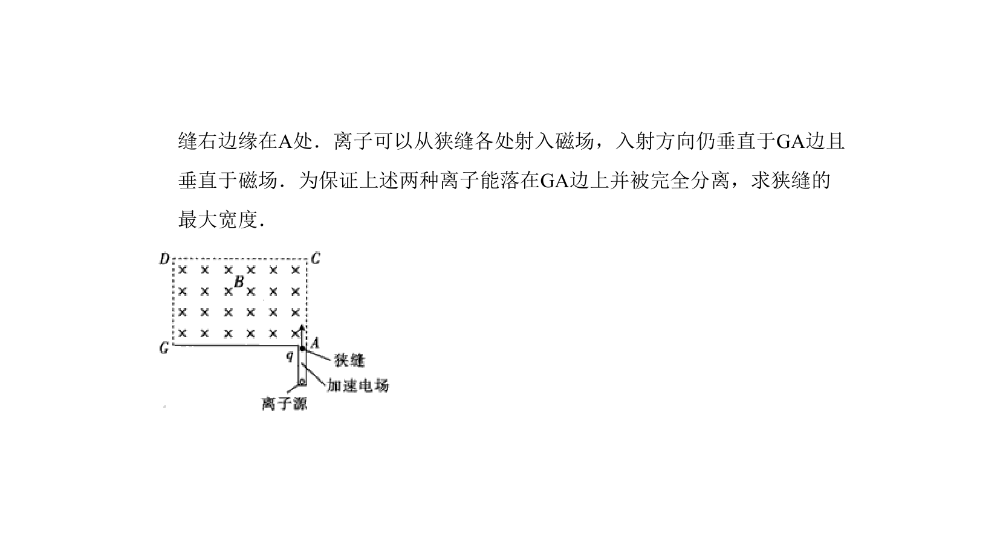

## 题面

## 摘要

电场加速与磁场偏转实现离子分离，计算入射速率、落点间距及狭缝宽度对分离的影响。

## 关联考点

- [[251-动能定理|动能定理]]
- [[843-带电粒子在匀强磁场中的圆周运动|带电粒子在匀强磁场中的圆周运动]]
- [[456-几何关系|几何关系]]
- [[离子分离条件]]

## 答案与解析

> 📄 原 PDF 第 5 页：`素材/真题/北京/2008-2024·（北京）物理高考真题/2011年高考物理试卷（北京）（解析卷）.pdf`

<!-- 题干文本-start -->
## 题干文本
11．（18分）利用电场和磁场，可以将比荷不同的离子分开，这种方法在化学
分析和原子核技术等领域有重要的应用．如图所示的矩形区域ACDG（AC边
足够长）中存在垂直于纸面的匀强磁场，A处有一狭缝．离子源产生的离子
，经静电场加速后穿过狭缝沿垂直于GA边且垂直于磁场的方向射入磁场，
运动到GA边，被相应的收集器收集．整个装置内部为真空．已知被加速的
两种正离子的质量分别是m1和m2（m1＞m2），电荷量均为q．加速电场的电
势差为U，离子进入电场时的初速度可以忽略．不计重力，也不考虑离子间
的相互作用．
（1）求质量为m1的离子进入磁场时的速率v1；
（2）当磁感应强度的大小为B时，求两种离子在GA边落点的间距s；
（3）在前面的讨论中忽略了狭缝宽度的影响，实际装置中狭缝具有一定宽度．
若狭缝过宽，可能使两束离子在GA边上的落点区域交叠，导致两种离子无
法完全分离．设磁感应强度大小可调，GA边长为定值L，狭缝宽度为d，狭
<!-- 题干文本-end -->

<!-- 解析文本-start -->
## 解析文本

<!-- 解析文本-end -->
