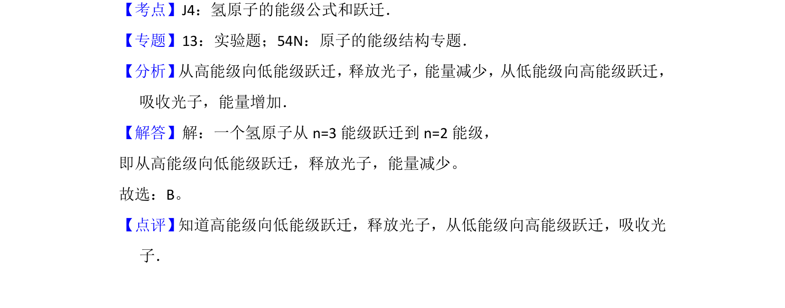

## 题面

## 摘要

氢原子从高能级跃迁到低能级时放出光子，能量减少。

## 关联考点

- [[758-氢原子能级跃迁|氢原子能级跃迁]]
- [[837-光子发射|光子发射]]
- [[197-能量守恒定律|能量守恒]]

## 答案与解析

> 📄 原 PDF 第 1 页：`素材/真题/北京/2008-2024·（北京）物理高考真题/2012年高考物理试卷（北京）（解析卷）.pdf`

<!-- 题干文本-start -->
## 题干文本
1． （3分）一个氢原子从n=3能级跃迁到n=2能级，该氢原子（　　）
A．放出光子，能量增加B．放出光子，能量减少
C．吸收光子，能量增加D．吸收光子，能量减少
<!-- 题干文本-end -->

<!-- 解析文本-start -->
## 解析文本
【考点】J4：氢原子的能级公式和跃迁．菁优网版权所有
【专题】13：实验题；54N：原子的能级结构专题．
【分析】 从高能级向低能级跃迁，释放光子，能量减少，从低能级向高能级跃迁，
吸收光子，能量增加．
【解答】解：一个氢原子从n=3能级跃迁到n=2能级，
即从高能级向低能级跃迁，释放光子，能量减少。
故选：B。
【点评】 知道高能级向低能级跃迁，释放光子，从低能级向高能级跃迁，吸收光
子．
<!-- 解析文本-end -->
