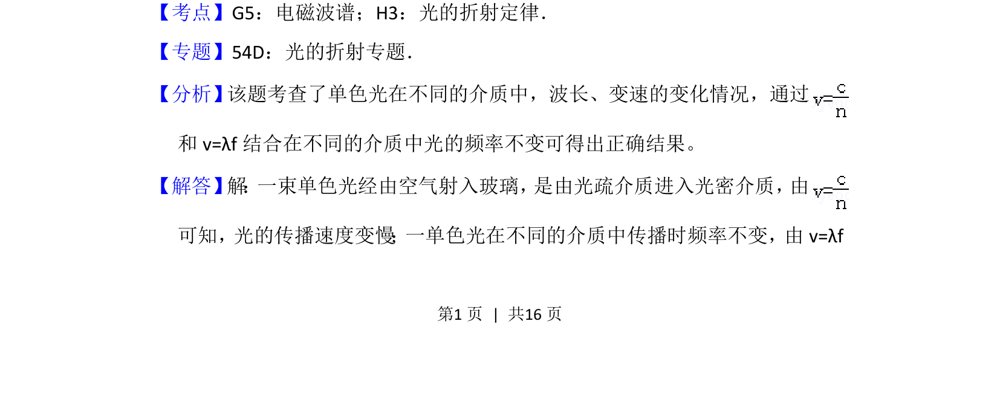
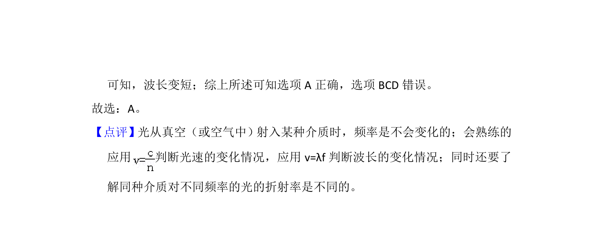

## 题面

## 摘要

单色光从空气射入玻璃，考查光在不同介质中速度、波长、频率的变化关系。

## 关联考点

- [[003-光的折射|光的折射]]
- [[370-波长|波长]]
- [[143-频数分布|频率]]
- [[006-光速|光速]]

## 答案与解析

> 📄 原 PDF 第 1 页：`素材/真题/北京/2008-2024·（北京）物理高考真题/2012年高考物理试卷（北京）（解析卷）.pdf`
