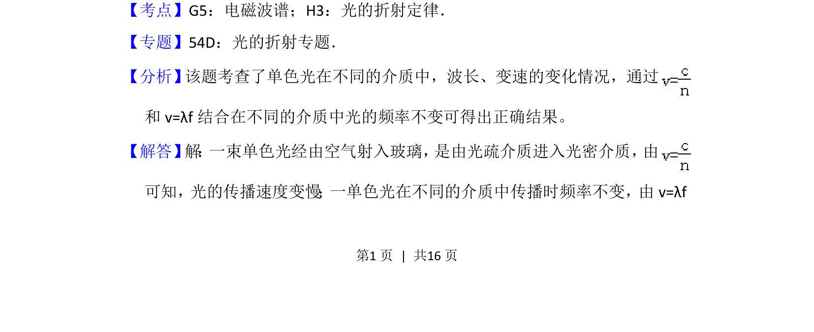
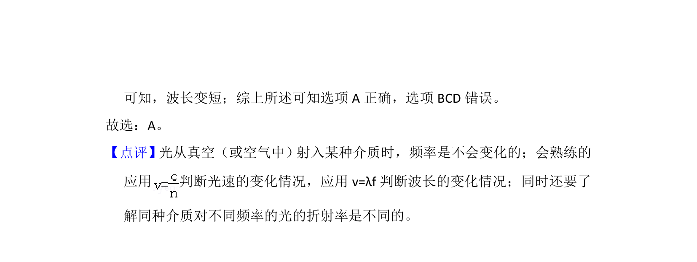

## 题面

## 摘要

单色光从空气射入玻璃，考查光在不同介质中速度、波长、频率的变化关系。

## 关联考点

- [[003-光的折射|光的折射]]
- [[370-波长|波长]]
- [[143-频数分布|频率]]
- [[006-光速|光速]]

## 答案与解析

> 📄 原 PDF 第 1 页：`素材/真题/北京/2008-2024·（北京）物理高考真题/2012年高考物理试卷（北京）（解析卷）.pdf`

<!-- 题干文本-start -->
## 题干文本
2． （3分）一束单色光经由空气射入玻璃，这束光的（　　）
A．速度变慢，波长变短B．速度不变，波长变短
C．频率增高，波长变长D．频率不变，波长变长
<!-- 题干文本-end -->

<!-- 解析文本-start -->
## 解析文本
【考点】G5：电磁波谱；H3：光的折射定律．菁优网版权所有
【专题】54D：光的折射专题．
【分析】 该题考查了单色光在不同的介质中，波长、变速的变化情况，通过
和v=λf结合在不同的介质中光的频率不变可得出正确结果。
【解答】 解 ： 一束单色光经由空气射入玻璃， 是由光疏介质进入光密介质， 由
可知，光的传播速度变慢 ； 一单色光在不同的介质中传播时频率不变，由v=λf
<!-- 解析文本-end -->
