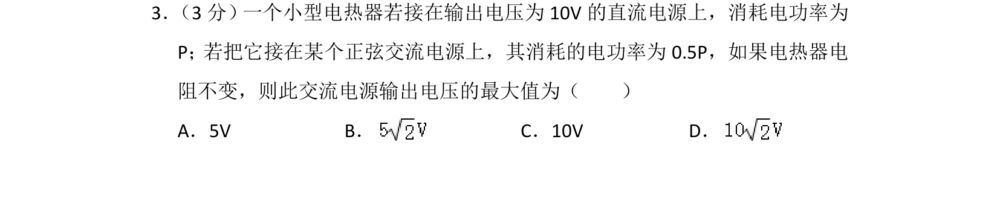
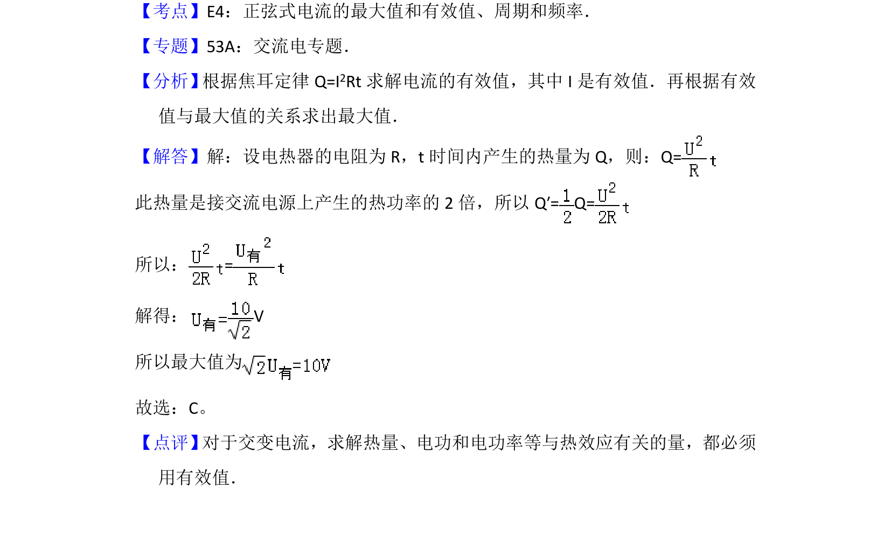

## 题面

## 摘要

考查交变电流有效值的计算，通过电功率关系求解交流电源输出电压的最大值。

## 关联考点

- [[632-正弦式电流的有效值|正弦式电流的有效值]]
- [[286-函数的最值|最大值]]
- [[热功率]]
- [[154-焦耳定律|焦耳定律]]

## 答案与解析

> 📄 原 PDF 第 2 页：`素材/真题/北京/2008-2024·（北京）物理高考真题/2012年高考物理试卷（北京）（解析卷）.pdf`
