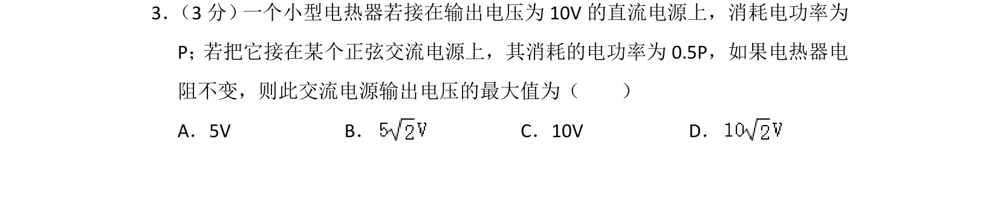
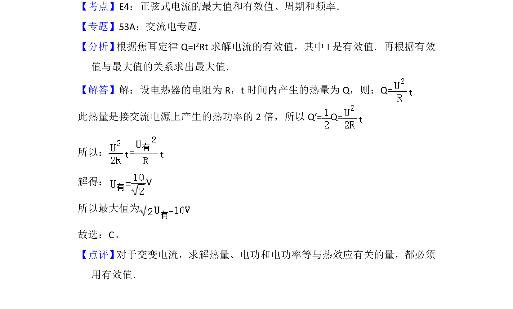

## 题面

## 摘要

考查交变电流有效值的计算，通过电功率关系求解交流电源输出电压的最大值。

## 关联考点

- [[632-正弦式电流的有效值|正弦式电流的有效值]]
- [[286-函数的最值|最大值]]
- [[热功率]]
- [[154-焦耳定律|焦耳定律]]

## 答案与解析

> 📄 原 PDF 第 2 页：`素材/真题/北京/2008-2024·（北京）物理高考真题/2012年高考物理试卷（北京）（解析卷）.pdf`

<!-- 题干文本-start -->
## 题干文本
3． （3分）一个小型电热器若接在输出电压为10V的直流电源上，消耗电功率为
P； 若把它接在某个正弦交流电源上，其消耗的电功率为0.5P，如果电热器电
阻不变，则此交流电源输出电压的最大值为（　　）
A．5V B．C．10V D．
<!-- 题干文本-end -->

<!-- 解析文本-start -->
## 解析文本
【考点】E4：正弦式电流的最大值和有效值、周期和频率．菁优网版权所有
【专题】53A：交流电专题．
【分析】 根据焦耳定律Q=I2Rt求解电流的有效值，其中I是有效值．再根据有效
值与最大值的关系求出最大值．
【解答】解：设电热器的电阻为R，t时间内产生的热量为Q，则：Q=
此热量是接交流电源上产生的热功率的2倍，所以Q′=Q=
所以：=
解得：V
所以最大值为
故选：C。
【点评】 对于交变电流，求解热量、电功和电功率等与热效应有关的量，都必须
用有效值．
<!-- 解析文本-end -->
