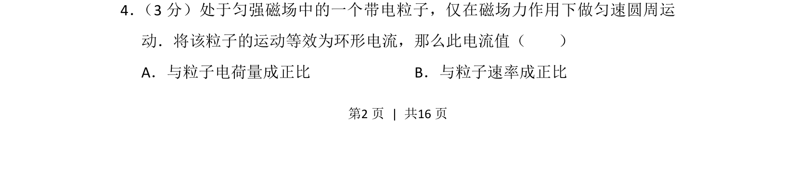
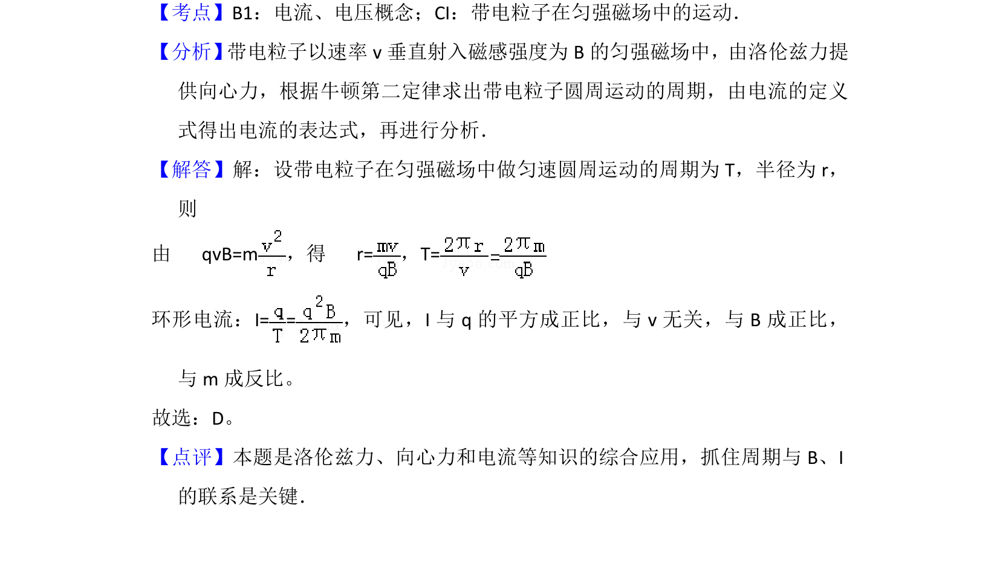

## 题面

## 摘要

带电粒子在匀强磁场中做匀速圆周运动的等效环形电流分析

## 关联考点

- [[595-带电粒子在匀强磁场中的运动|带电粒子在匀强磁场中的运动]]
- [[等效环形电流]]
- [[304-洛伦兹力|洛伦兹力]]

## 答案与解析

> 📄 原 PDF 第 2 页：`素材/真题/北京/2008-2024·（北京）物理高考真题/2012年高考物理试卷（北京）（解析卷）.pdf`
