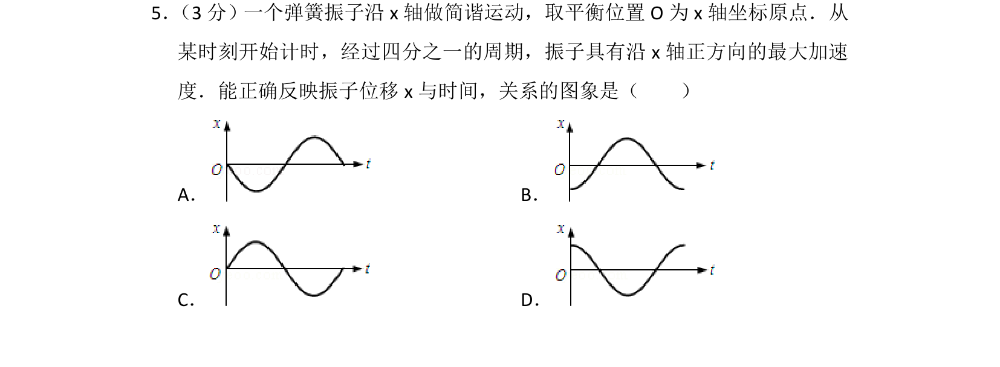
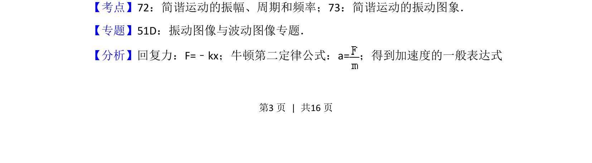
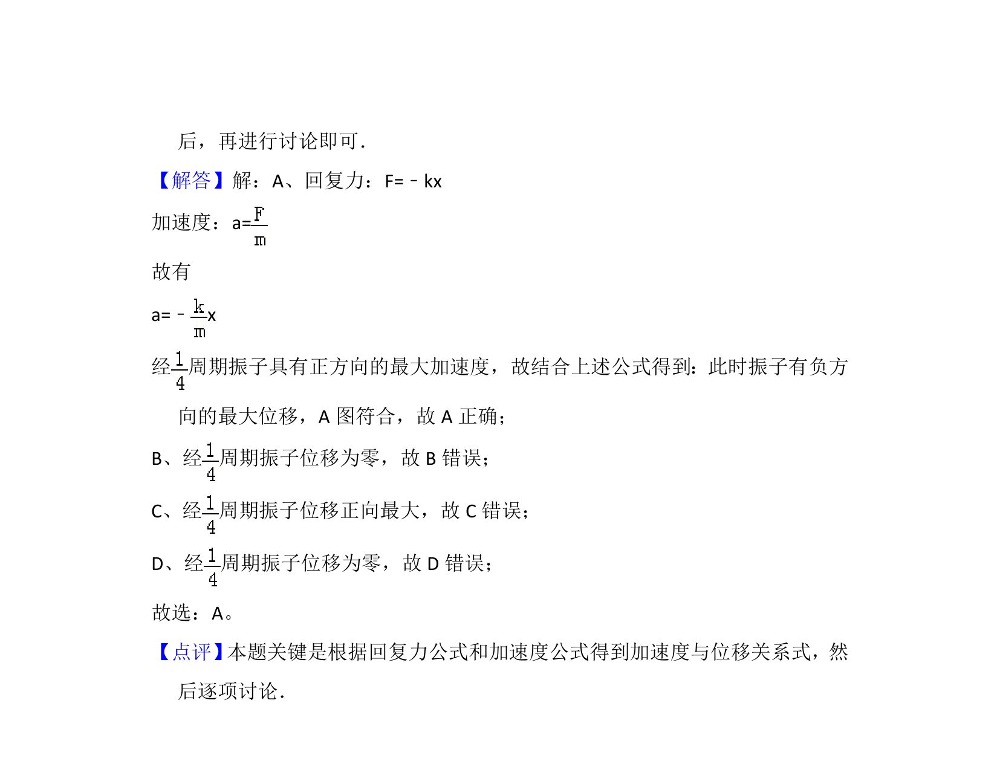

## 题面

## 摘要

一个弹簧振子做简谐运动，给定四分之一周期时加速度方向，判断位移时间图象。

## 关联考点

- [[373-简谐运动|简谐运动]]
- [[614-振动图象|振动图象]]
- [[加速度与位移关系]]

## 答案与解析

> 📄 原 PDF 第 3 页：`素材/真题/北京/2008-2024·（北京）物理高考真题/2012年高考物理试卷（北京）（解析卷）.pdf`
