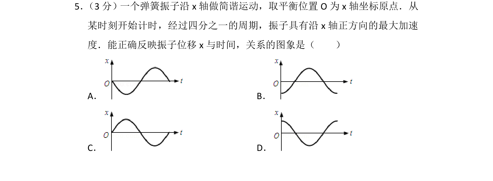
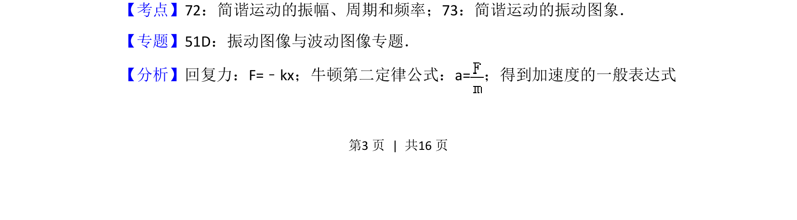
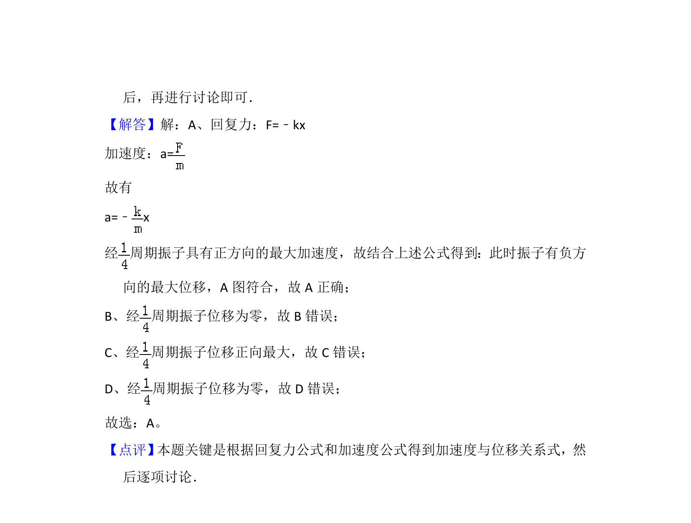

## 题面

## 摘要

一个弹簧振子做简谐运动，给定四分之一周期时加速度方向，判断位移时间图象。

## 关联考点

- [[373-简谐运动|简谐运动]]
- [[857-振动图像|振动图象]]
- [[加速度与位移关系]]

## 答案与解析

> 📄 原 PDF 第 3 页：`素材/真题/北京/2008-2024·（北京）物理高考真题/2012年高考物理试卷（北京）（解析卷）.pdf`

<!-- 题干文本-start -->
## 题干文本
5． （3分）一个弹簧振子沿x轴做简谐运动，取平衡位置O为x轴坐标原点．从
某时刻开始计时，经过四分之一的周期，振子具有沿x轴正方向的最大加速
度．能正确反映振子位移x与时间，关系的图象是（　　）
A．B．
C．D．
<!-- 题干文本-end -->

<!-- 解析文本-start -->
## 解析文本
【考点】72：简谐运动的振幅、周期和频率；73：简谐运动的振动图象．菁优网版权所有
【专题】51D：振动图像与波动图像专题．
【分析】回复力：F=﹣kx；牛顿第二定律公式：a=；得到加速度的一般表达式
<!-- 解析文本-end -->
