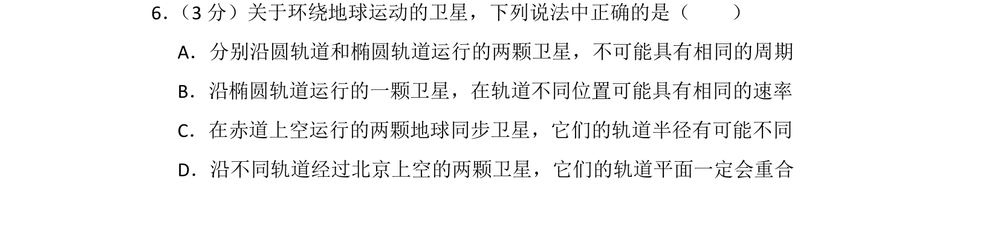
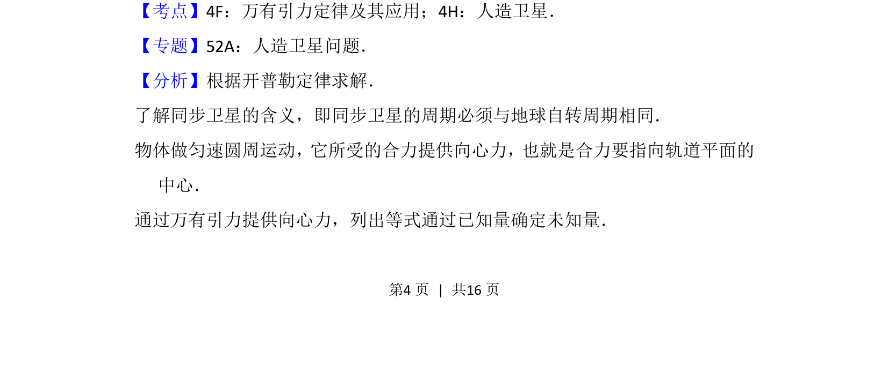
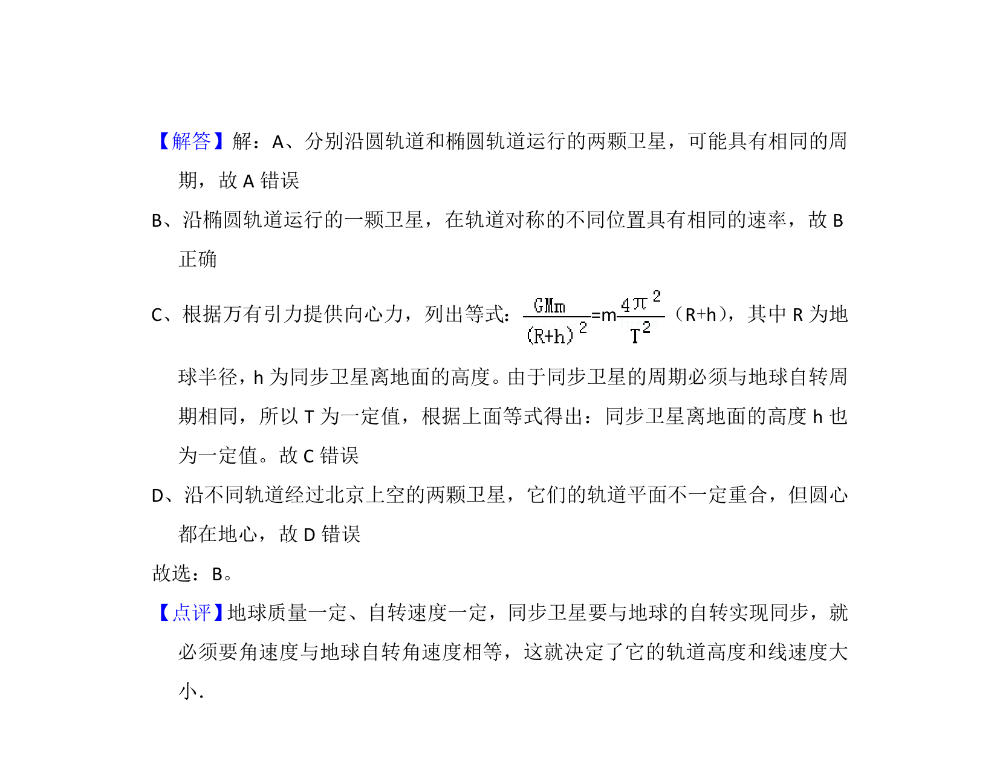

## 题面

## 摘要

分别沿圆轨道和椭圆轨道运行的卫星周期与速率关系，以及同步卫星和轨道平面特性。

## 关联考点

- [[246-万有引力定律|万有引力定律]]
- [[人造卫星]]
- [[605-开普勒定律|开普勒定律]]
- [[560-同步卫星|同步卫星]]

## 答案与解析

> 📄 原 PDF 第 4 页：`素材/真题/北京/2008-2024·（北京）物理高考真题/2012年高考物理试卷（北京）（解析卷）.pdf`
