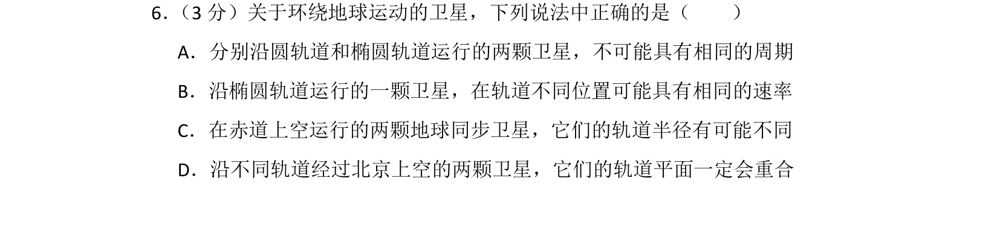
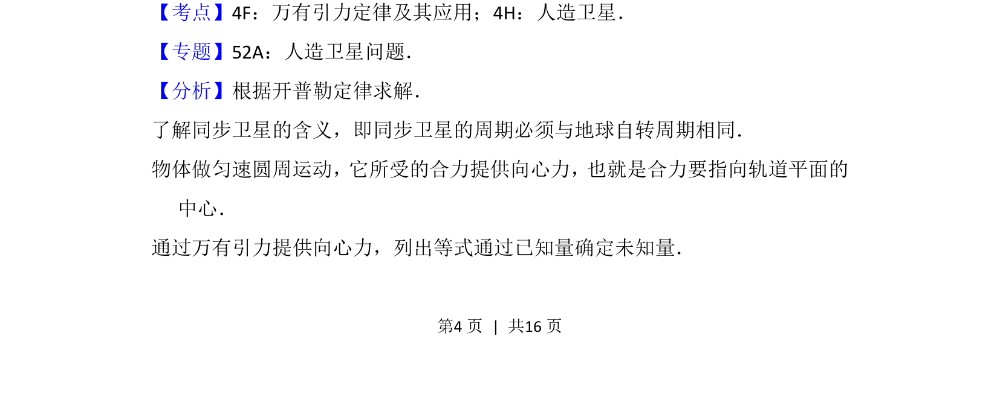
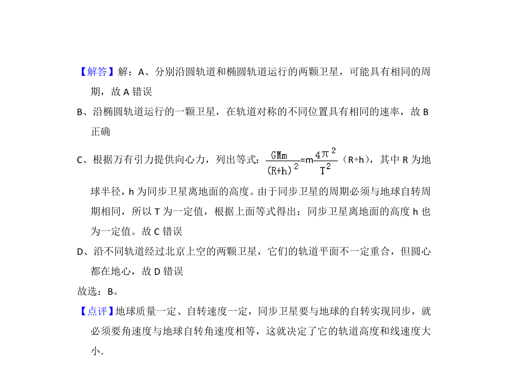

## 题面

## 摘要

分别沿圆轨道和椭圆轨道运行的卫星周期与速率关系，以及同步卫星和轨道平面特性。

## 关联考点

- [[246-万有引力定律|万有引力定律]]
- [[836-人造卫星|人造卫星]]
- [[605-开普勒定律|开普勒定律]]
- [[560-同步卫星|同步卫星]]

## 答案与解析

> 📄 原 PDF 第 4 页：`素材/真题/北京/2008-2024·（北京）物理高考真题/2012年高考物理试卷（北京）（解析卷）.pdf`

<!-- 题干文本-start -->
## 题干文本
6． （3分）关于环绕地球运动的卫星，下列说法中正确的是（　　）
A．分别沿圆轨道和椭圆轨道运行的两颗卫星，不可能具有相同的周期
B．沿椭圆轨道运行的一颗卫星，在轨道不同位置可能具有相同的速率
C．在赤道上空运行的两颗地球同步卫星，它们的轨道半径有可能不同
D．沿不同轨道经过北京上空的两颗卫星，它们的轨道平面一定会重合
<!-- 题干文本-end -->

<!-- 解析文本-start -->
## 解析文本
【考点】4F：万有引力定律及其应用；4H：人造卫星．菁优网版权所有
【专题】52A：人造卫星问题．
【分析】根据开普勒定律求解．
了解同步卫星的含义，即同步卫星的周期必须与地球自转周期相同．
物体做匀速圆周运动，它所受的合力提供向心力，也就是合力要指向轨道平面的
中心．
通过万有引力提供向心力，列出等式通过已知量确定未知量．
<!-- 解析文本-end -->
