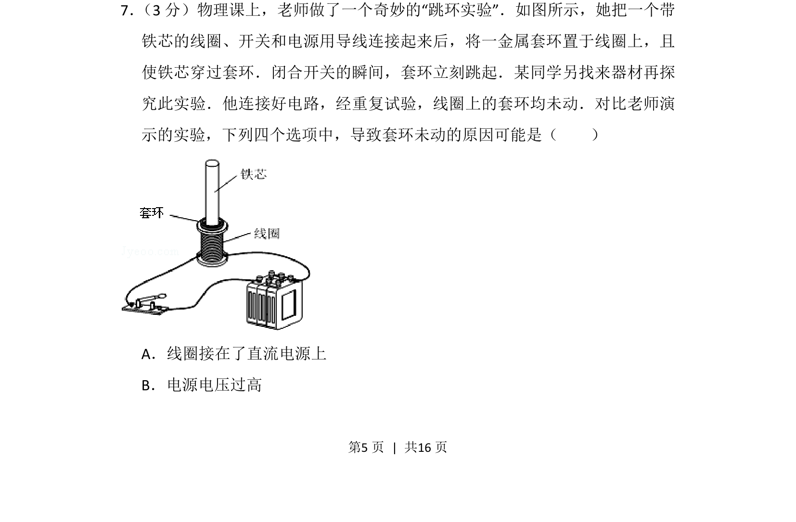
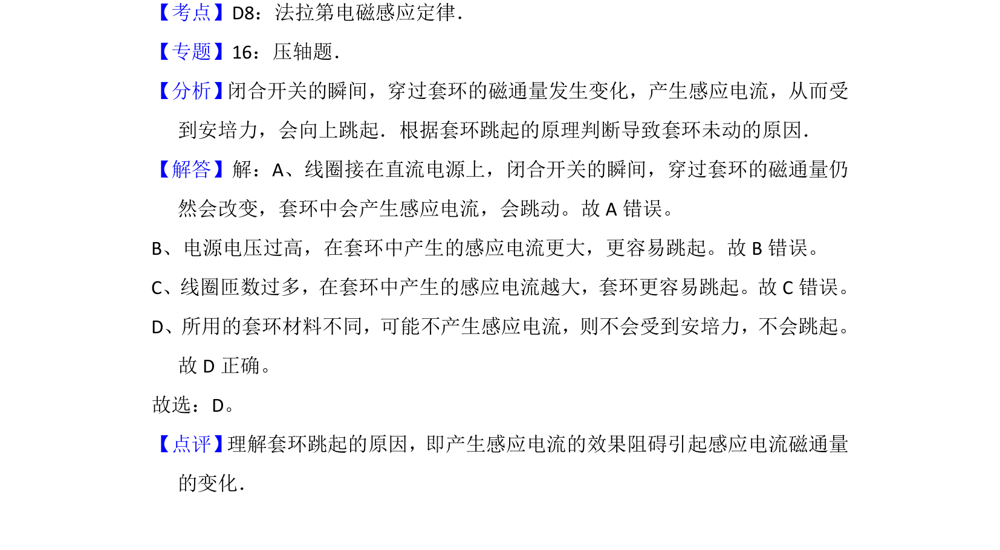

## 题面

## 摘要

考查跳环实验原理，通过线圈通电时套环跳起的现象分析可能故障原因。

## 关联考点

- [[393-楞次定律|楞次定律]]
- [[175-电磁感应|电磁感应]]
- [[397-涡流|涡流]]
- [[电路连接]]

## 答案与解析

> 📄 原 PDF 第 5 页：`素材/真题/北京/2008-2024·（北京）物理高考真题/2012年高考物理试卷（北京）（解析卷）.pdf`
