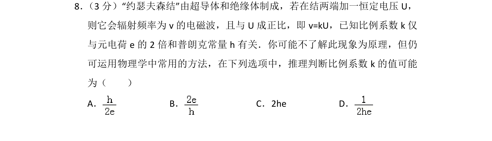
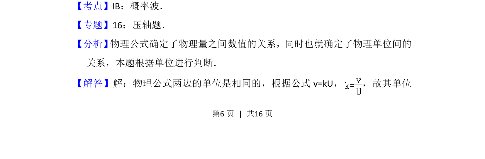
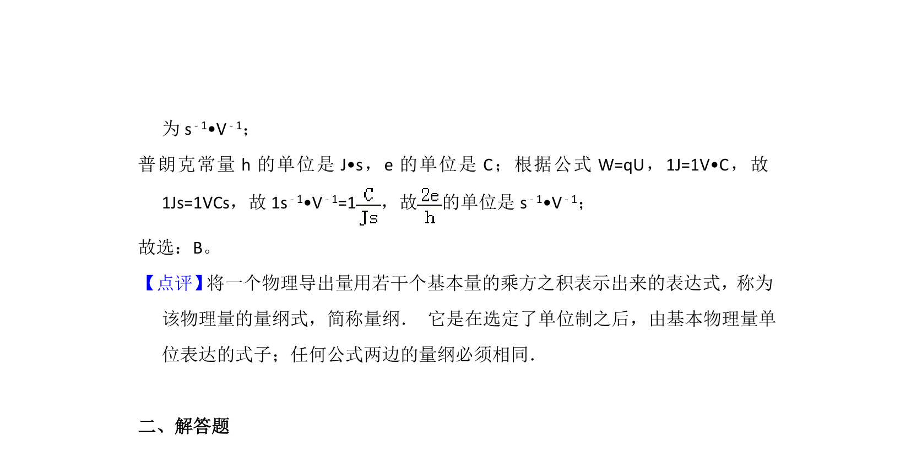

## 题面

## 摘要

通过物理量单位推导约瑟夫森结中比例系数k的可能值，考察量纲分析。

## 关联考点

- [[832-量纲分析|量纲分析]]
- [[普朗克常量]]
- [[247-元电荷|元电荷]]
- [[电磁波频率]]

## 答案与解析

> 📄 原 PDF 第 6 页：`素材/真题/北京/2008-2024·（北京）物理高考真题/2012年高考物理试卷（北京）（解析卷）.pdf`
