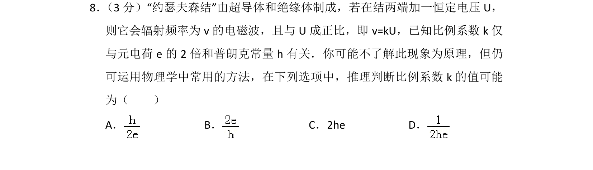
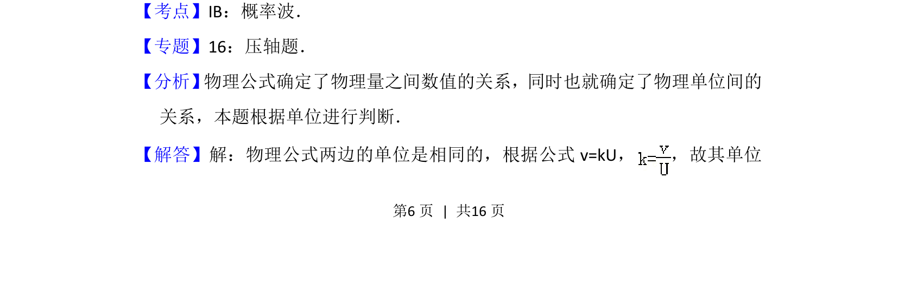
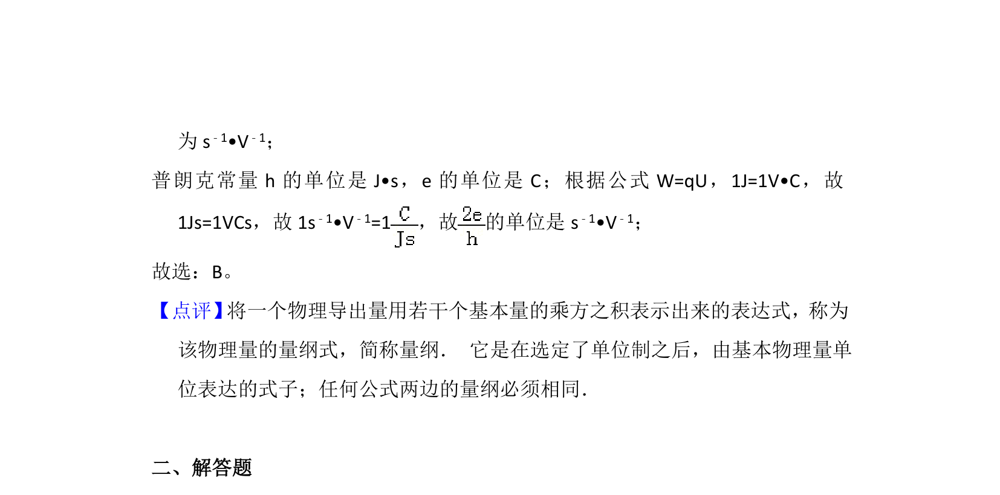

## 题面

## 摘要

通过物理量单位推导约瑟夫森结中比例系数k的可能值，考察量纲分析。

## 关联考点

- [[832-量纲分析|量纲分析]]
- [[普朗克常量]]
- [[247-元电荷|元电荷]]
- [[电磁波频率]]

## 答案与解析

> 📄 原 PDF 第 6 页：`素材/真题/北京/2008-2024·（北京）物理高考真题/2012年高考物理试卷（北京）（解析卷）.pdf`

<!-- 题干文本-start -->
## 题干文本
8． （3分）“约瑟夫森结”由超导体和绝缘体制成，若在结两端加一恒定电压U，
则它会辐射频率为v的电磁波，且与U成正比，即v=kU，已知比例系数k仅
与元电荷e的2倍和普朗克常量h有关．你可能不了解此现象为原理，但仍
可运用物理学中常用的方法，在下列选项中，推理判断比例系数k的值可能
为（　　）
A．B．C．2he D．
<!-- 题干文本-end -->

<!-- 解析文本-start -->
## 解析文本
【考点】IB：概率波．菁优网版权所有
【专题】16：压轴题．
【分析】 物理公式确定了物理量之间数值的关系，同时也就确定了物理单位间的
关系，本题根据单位进行判断．
【解答】解：物理公式两边的单位是相同的，根据公式v=kU， ，故其单位
<!-- 解析文本-end -->
