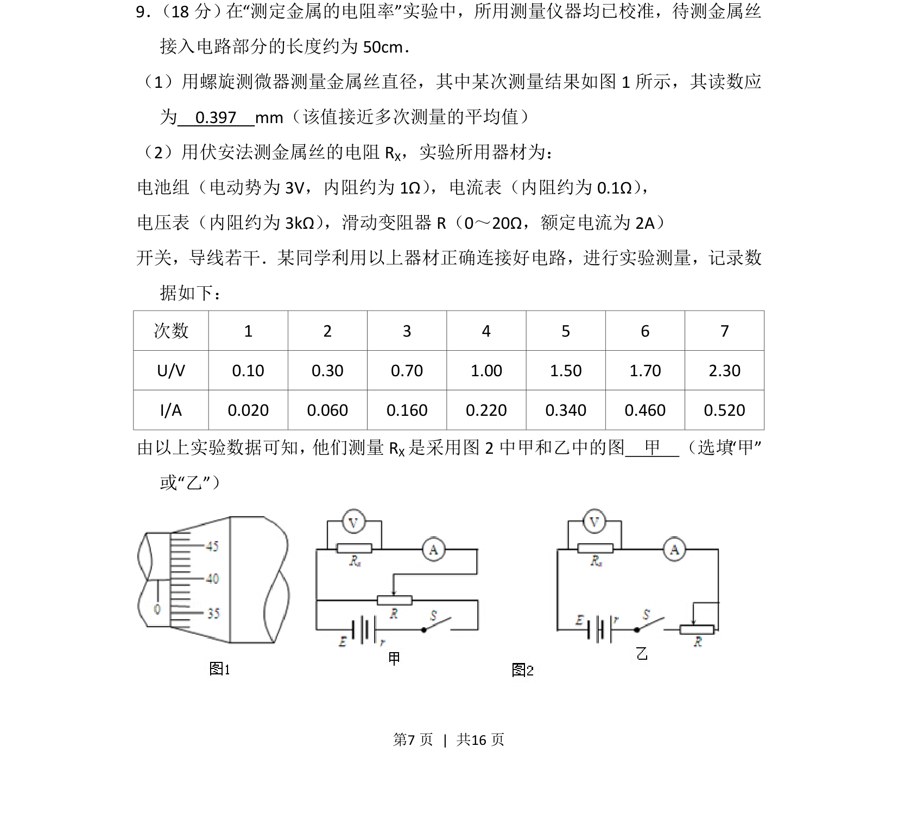
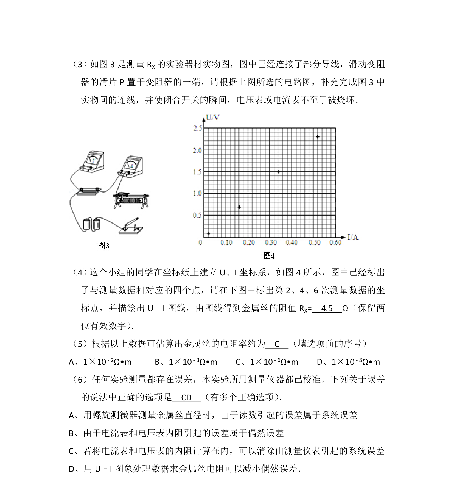
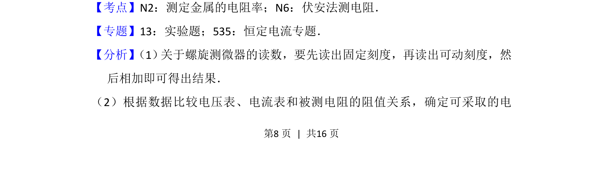
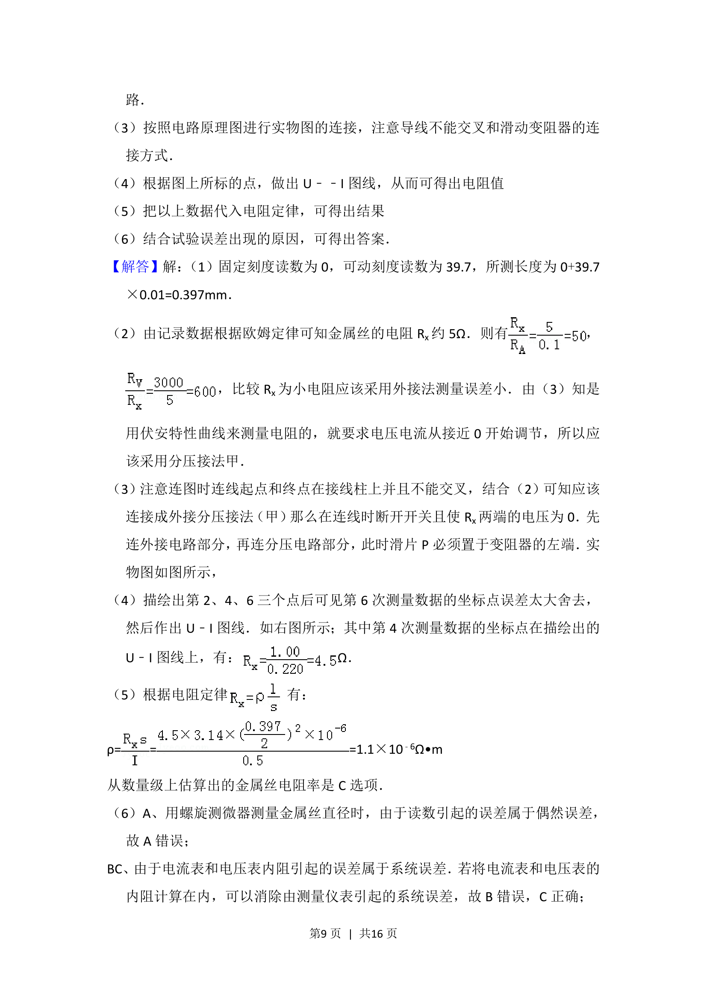
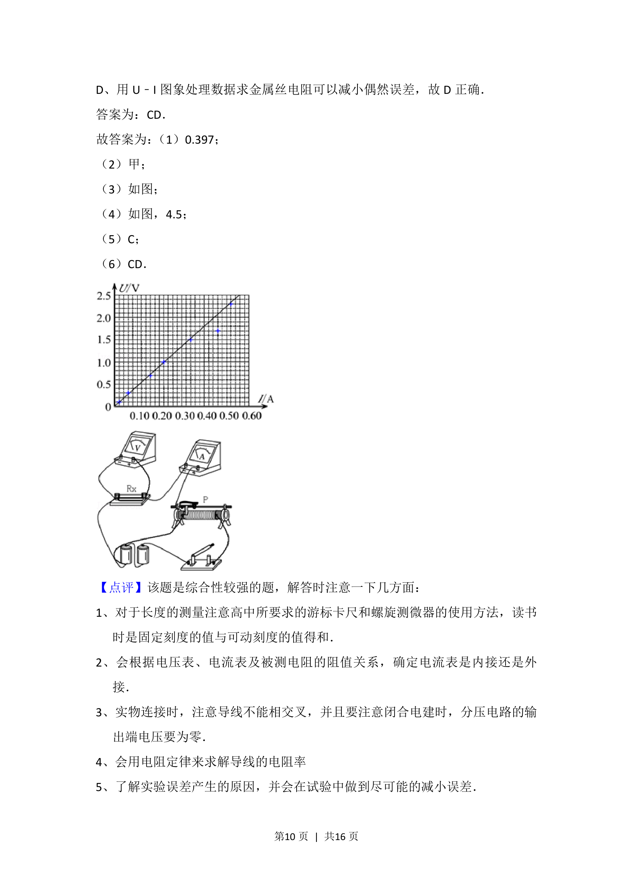

## 题面

## 摘要

测定金属电阻率实验中，包含螺旋测微器读数和根据实验数据选择伏安法电路（分压或限流）。

## 关联考点

- [[771-螺旋测微器读数|螺旋测微器读数]]
- [[511-伏安法测电阻|伏安法测电阻]]
- [[滑动变阻器分压与限流接法]]

## 答案与解析

> 📄 原 PDF 第 7 页：`素材/真题/北京/2008-2024·（北京）物理高考真题/2012年高考物理试卷（北京）（解析卷）.pdf`
