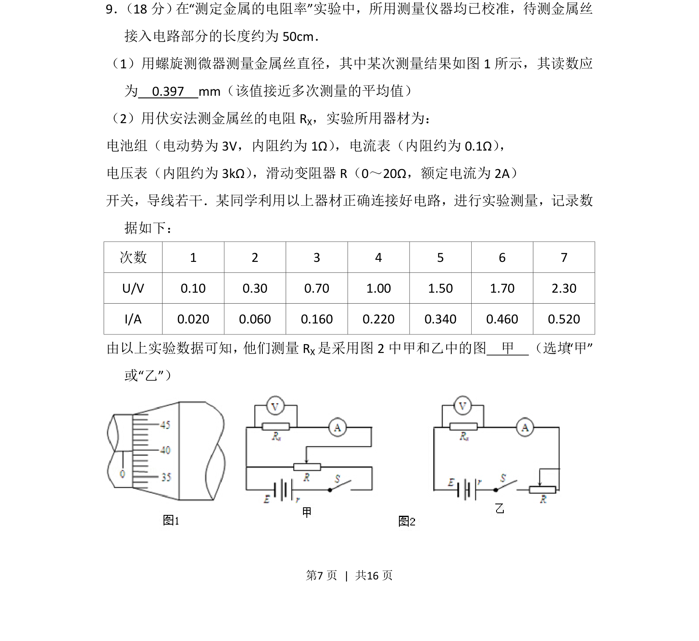
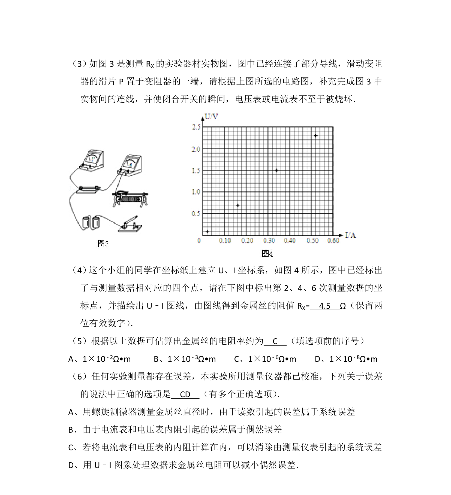
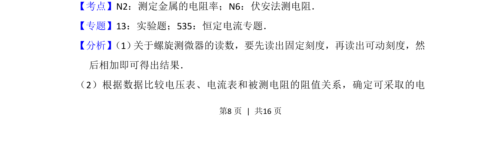
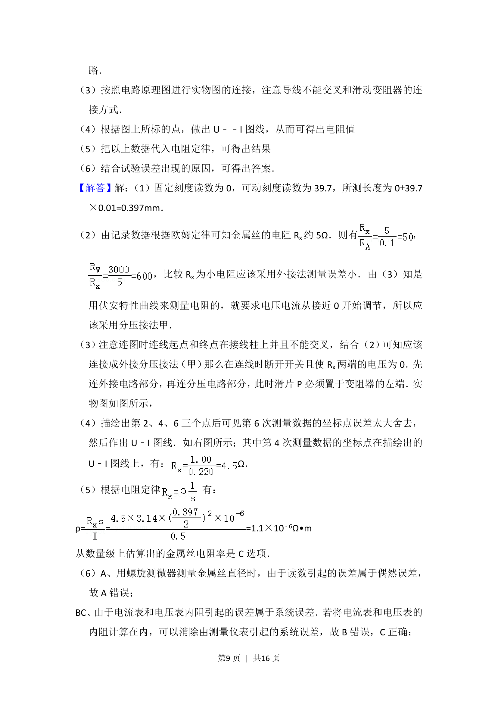
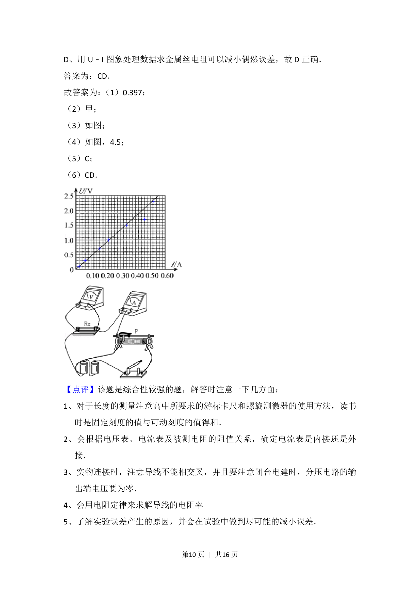

## 题面

## 摘要

测定金属电阻率实验中，包含螺旋测微器读数和根据实验数据选择伏安法电路（分压或限流）。

## 关联考点

- [[770-螺旋测微器读数|螺旋测微器读数]]
- [[511-伏安法测电阻|伏安法测电阻]]
- [[滑动变阻器分压与限流接法]]

## 答案与解析

> 📄 原 PDF 第 7 页：`素材/真题/北京/2008-2024·（北京）物理高考真题/2012年高考物理试卷（北京）（解析卷）.pdf`

<!-- 题干文本-start -->
## 题干文本
9． （18分） 在“测定金属的电阻率”实验中，所用测量仪器均已校准，待测金属丝
接入电路部分的长度约为50cm．
（1）用螺旋测微器测量金属丝直径，其中某次测量结果如图1所示，其读数应
为　0.397　mm（该值接近多次测量的平均值）
（2）用伏安法测金属丝的电阻R X，实验所用器材为：
电池组（电动势为3V，内阻约为1Ω） ，电流表（内阻约为0.1Ω） ，
电压表（内阻约为3kΩ） ，滑动变阻器R（0～20Ω，额定电流为2A）
开关，导线若干．某同学利用以上器材正确连接好电路，进行实验测量，记录数
据如下：
次数 1 2 3 4 5 6 7
U/V 0.10 0.30 0.70 1.00 1.50 1.70 2.30
I/A 0.020 0.060 0.160 0.220 0.340 0.460 0.520
由以上实验数据可知， 他们测量RX是采用图2中甲和乙中的图　甲　（选填“甲”
或“乙”）
<!-- 题干文本-end -->

<!-- 解析文本-start -->
## 解析文本

<!-- 解析文本-end -->
