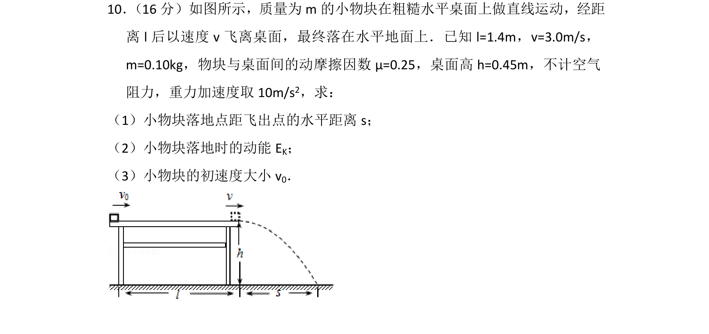
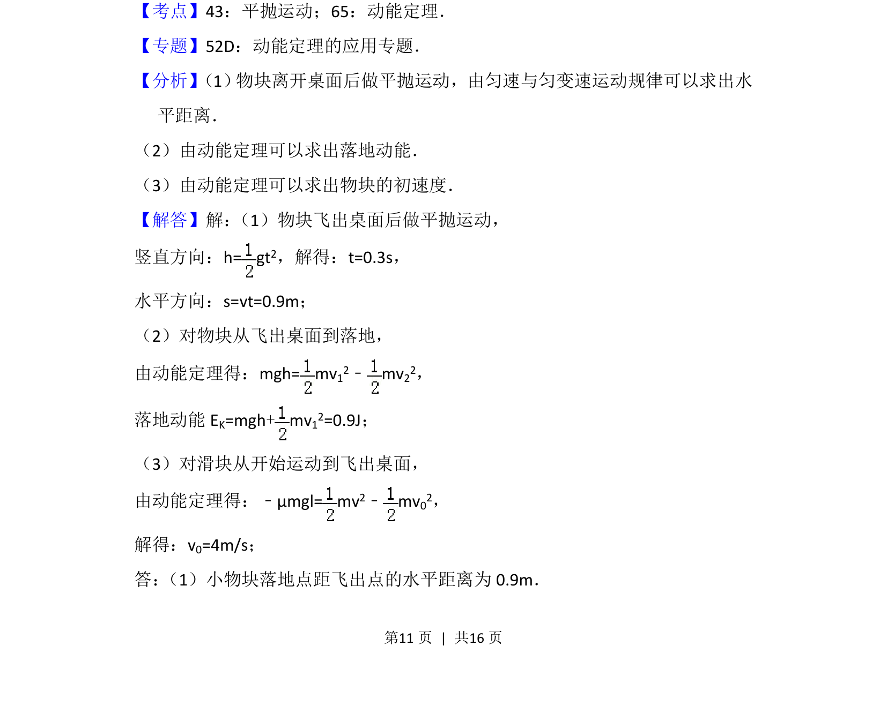
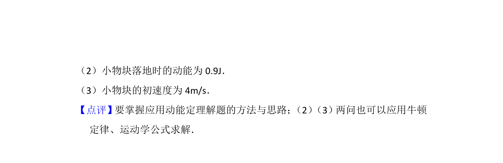

## 题面

## 摘要

小物块先在粗糙桌面减速，后做平抛运动，考查运动学和动能定理的综合应用。

## 关联考点

- [[261-平抛运动|平抛运动]]
- [[251-动能定理|动能定理]]
- [[215-匀变速直线运动|匀变速直线运动]]
- [[765-摩擦力做功|摩擦力做功]]

## 答案与解析

> 📄 原 PDF 第 11 页：`素材/真题/北京/2008-2024·（北京）物理高考真题/2012年高考物理试卷（北京）（解析卷）.pdf`
