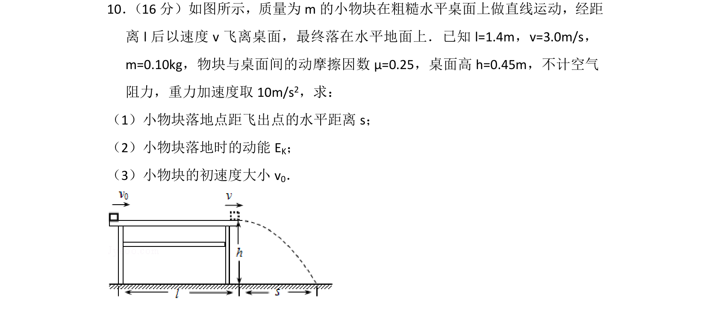
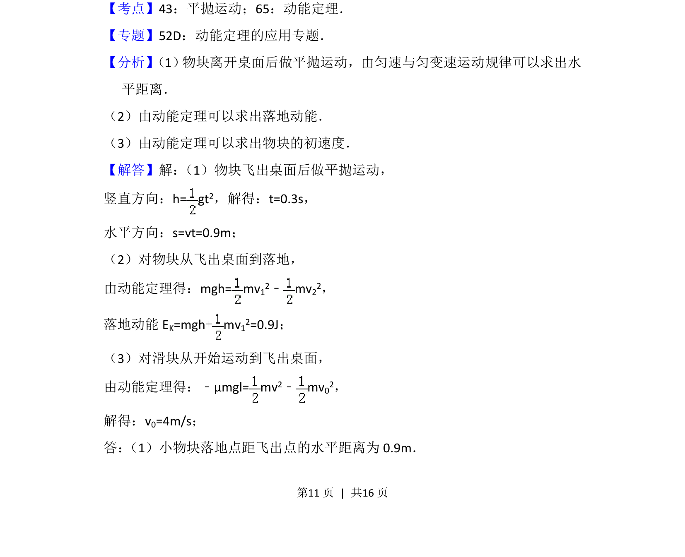
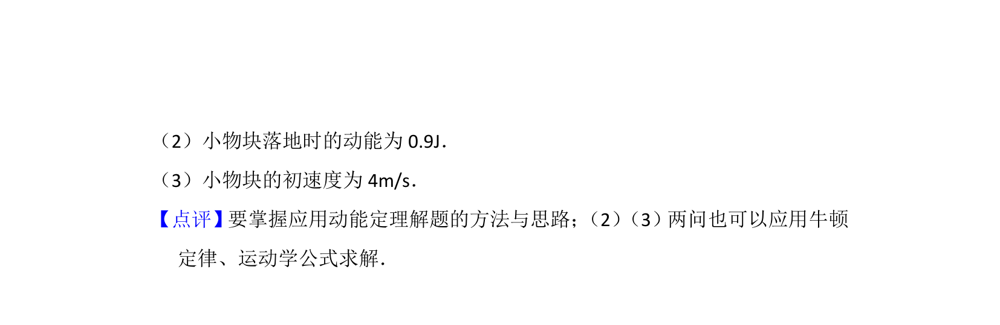

## 题面

## 摘要

小物块先在粗糙桌面减速，后做平抛运动，考查运动学和动能定理的综合应用。

## 关联考点

- [[261-平抛运动|平抛运动]]
- [[251-动能定理|动能定理]]
- [[215-匀变速直线运动|匀变速直线运动]]
- [[765-摩擦力做功|摩擦力做功]]

## 答案与解析

> 📄 原 PDF 第 11 页：`素材/真题/北京/2008-2024·（北京）物理高考真题/2012年高考物理试卷（北京）（解析卷）.pdf`

<!-- 题干文本-start -->
## 题干文本
10． （16分）如图所示，质量为m的小物块在粗糙水平桌面上做直线运动，经距
离l后以速度v飞离桌面，最终落在水平地面上．已知l=1.4m，v=3.0m/s，
m=0.10kg，物块与桌面间的动摩擦因数μ=0.25，桌面高h=0.45m，不计空气
阻力，重力加速度取10m/s 2，求：
（1）小物块落地点距飞出点的水平距离s；
（2）小物块落地时的动能E K；
（3）小物块的初速度大小v 0．
<!-- 题干文本-end -->

<!-- 解析文本-start -->
## 解析文本
【考点】43：平抛运动；65：动能定理．菁优网版权所有
【专题】52D：动能定理的应用专题．
【分析】 （1） 物块离开桌面后做平抛运动，由匀速与匀变速运动规律可以求出水
平距离．
（2）由动能定理可以求出落地动能．
（3）由动能定理可以求出物块的初速度．
【解答】解： （1）物块飞出桌面后做平抛运动，
竖直方向：h= gt 2，解得：t=0.3s，
水平方向：s=vt=0.9m；
（2）对物块从飞出桌面到落地，
由动能定理得：mgh= mv 12﹣mv 22，
落地动能E K=mgh+mv 12=0.9J；
（3）对滑块从开始运动到飞出桌面，
由动能定理得：﹣μmgl=mv 2﹣mv 02，
解得：v0=4m/s；
答： （1）小物块落地点距飞出点的水平距离为0.9m．
<!-- 解析文本-end -->
