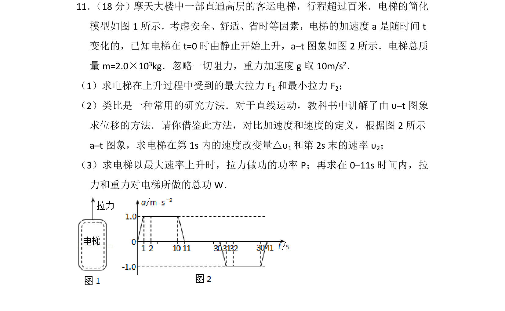
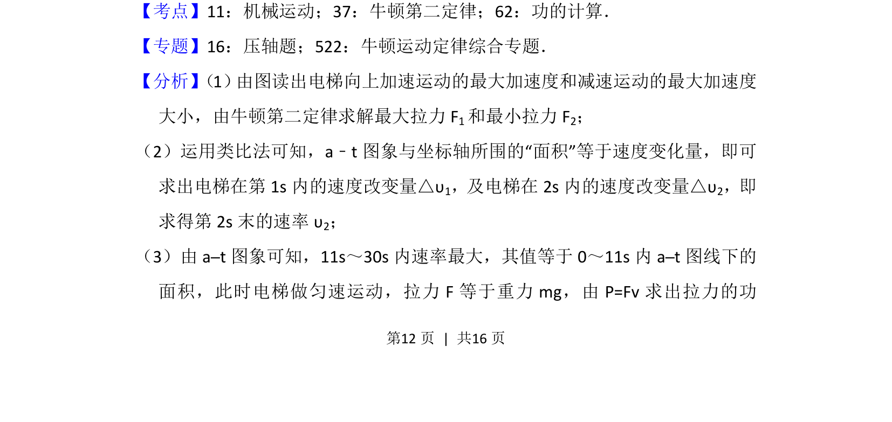
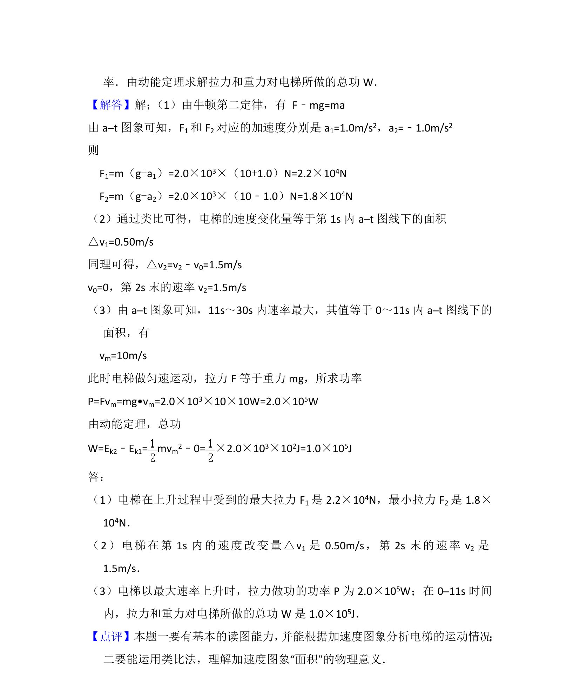

## 题面

## 摘要

电梯在变加速上升过程中，利用a-t图像结合牛顿定律和功的计算，考查图像分析与力学综合。

## 关联考点

- [[031-机械运动|机械运动]]
- [[229-牛顿第二定律|牛顿第二定律]]
- [[755-功的计算|功的计算]]
- [[a-t图像]]

## 答案与解析

> 📄 原 PDF 第 12 页：`素材/真题/北京/2008-2024·（北京）物理高考真题/2012年高考物理试卷（北京）（解析卷）.pdf`
