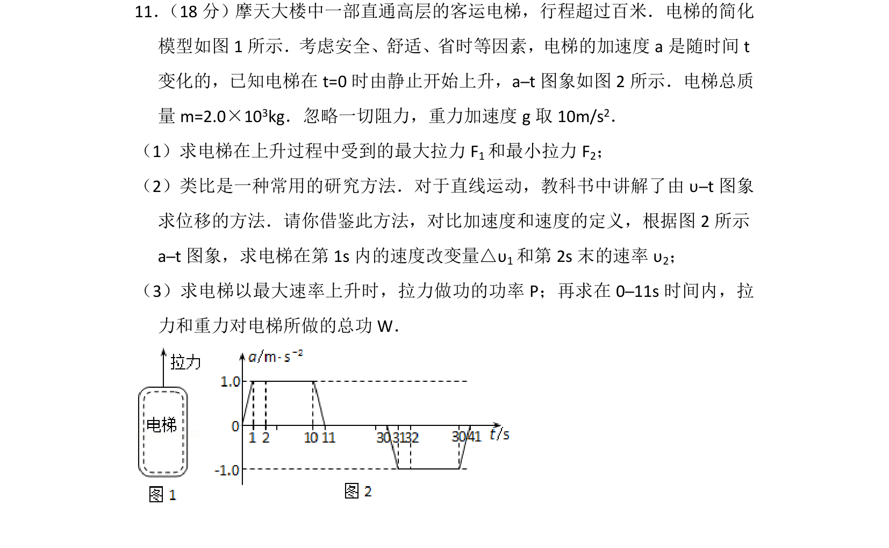
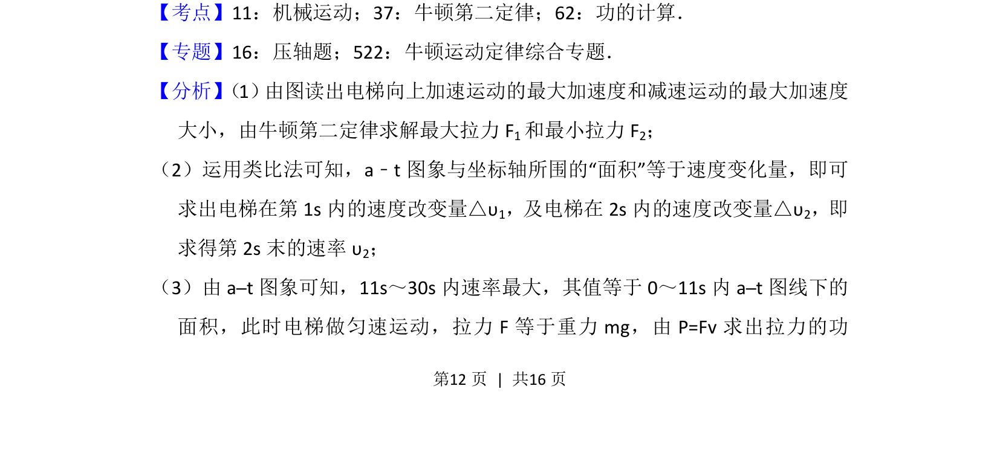
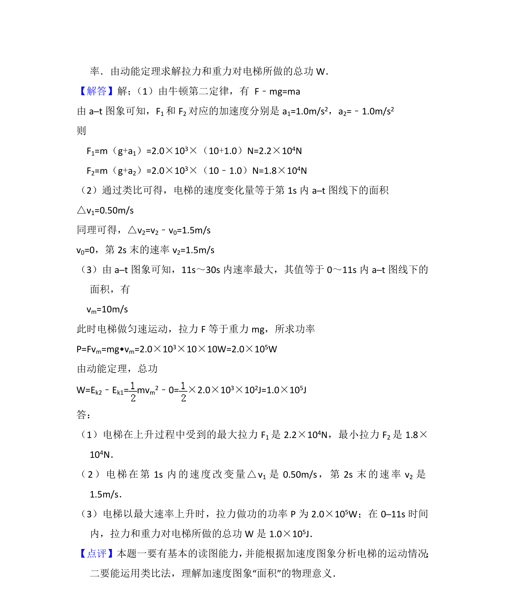

## 题面

## 摘要

电梯在变加速上升过程中，利用a-t图像结合牛顿定律和功的计算，考查图像分析与力学综合。

## 关联考点

- [[031-机械运动|机械运动]]
- [[229-牛顿第二定律|牛顿第二定律]]
- [[754-功的计算|功的计算]]
- [[a-t图像]]

## 答案与解析

> 📄 原 PDF 第 12 页：`素材/真题/北京/2008-2024·（北京）物理高考真题/2012年高考物理试卷（北京）（解析卷）.pdf`

<!-- 题干文本-start -->
## 题干文本
11． （18分）摩天大楼中一部直通高层的客运电梯，行程超过百米．电梯的简化
模型如图1所示．考虑安全、舒适、省时等因素，电梯的加速度a是随时间t
变化的，已知电梯在t=0时由静止开始上升，a─t图象如图2所示．电梯总质
量m=2.0×10 3kg．忽略一切阻力，重力加速度g取10m/s 2．
（1）求电梯在上升过程中受到的最大拉力F 1和最小拉力F 2；
（2）类比是一种常用的研究方法．对于直线运动，教科书中讲解了由υ─t图象
求位移的方法．请你借鉴此方法，对比加速度和速度的定义，根据图2所示
a─t图象，求电梯在第1s内的速度改变量△υ 1和第2s末的速率υ 2；
（3）求电梯以最大速率上升时，拉力做功的功率P；再求在0─11s时间内，拉
力和重力对电梯所做的总功W．
<!-- 题干文本-end -->

<!-- 解析文本-start -->
## 解析文本
【考点】11：机械运动；37：牛顿第二定律；62：功的计算．菁优网版权所有
【专题】16：压轴题；522：牛顿运动定律综合专题．
【分析】 （1） 由图读出电梯向上加速运动的最大加速度和减速运动的最大加速度
大小，由牛顿第二定律求解最大拉力F 1和最小拉力F 2；
（2）运用类比法可知，a﹣t图象与坐标轴所围的“面积”等于速度变化量，即可
求出电梯在第1s内的速度改变量△υ 1，及电梯在2s内的速度改变量△υ 2，即
求得第2s末的速率υ 2；
（3）由a─t图象可知，11s～30s内速率最大，其值等于0～11s内a─t图线下的
面积，此时电梯做匀速运动，拉力F等于重力mg，由P=Fv求出拉力的功
<!-- 解析文本-end -->
